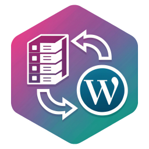
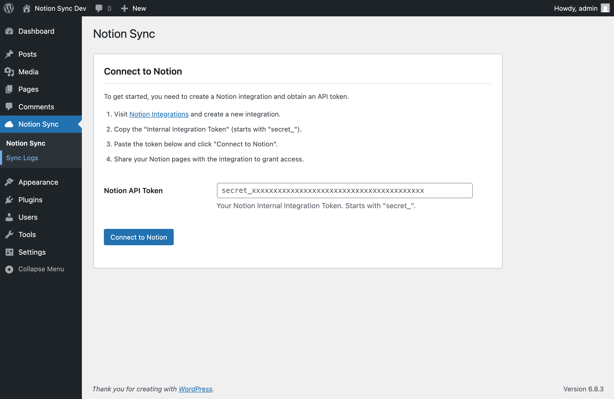

<div align="center">
  
</div>

# Vger Sync for Notion

[](https://github.com/thevgergroup/notion-wp/actions/workflows/test.yml)
[](https://github.com/thevgergroup/notion-wp/actions/workflows/lint.yml)
[](https://gist.github.com/pjaol/2cb753e52d7fcf0a1176d34f406ad613)
[](https://www.php.net/)
[](https://wordpress.org/)
[](LICENSE)

**Sync your Notion pages and databases to WordPress with automatic navigation menus and embedded database views.**

Write and organize your content in Notion, then publish it to your WordPress site with one click. Perfect for teams who love Notion's collaborative writing experience but need WordPress for their public-facing website.

---

## Table of Contents

- [Features](#features)
- [Screenshots](#screenshots)
- [Installation](#installation)
- [How It Works](#how-it-works)
- [Requirements](#requirements)
- [Documentation](#documentation)
- [Support](#support)
- [Roadmap](#roadmap)
- [Contributing](#contributing)
- [License](#license)
- [Credits](#credits)
- [Show Your Support](#show-your-support)

---

## Features

- **One-Click Page Sync** - Import Notion pages as WordPress posts with rich content
- **Automatic Menus** - Generate WordPress navigation menus from your Notion page hierarchy
- **Collapsible Sidebar Navigation** - Ready-to-use block patterns with hierarchical menus ([Learn more](docs/features/BLOCK-PATTERNS.md))
- **Embedded Database Tables** - Display Notion databases as interactive tables on your site
- **Rich Content Support** - Images, tables, code blocks, callouts, toggles, and more
- **Background Processing** - Handle large imports without timeouts
- **Parent-Child Hierarchies** - Maintain nested page structures from Notion
- **Internal Link Resolution** - Notion page links automatically convert to WordPress permalinks
- **Coming Soon:** Board, gallery, timeline, and calendar database views
- **Coming Soon:** WordPress → Notion bi-directional sync

---

## Screenshots

### Settings - Connection
Configure your Notion integration token to connect WordPress with Notion.



### Page Selection
Choose which Notion pages to sync to your WordPress site.


### Sync Dashboard
Monitor sync status and manage your synced content.


**[View more screenshots →](docs/SCREENSHOTS.md)** - See examples of published content, database tables, and navigation menus.

---

## Installation

### From GitHub (Manual Installation)

1. Download the latest release from the [Releases page](https://github.com/thevgergroup/notion-wp/releases)
2. Upload the `vger-sync-for-notion` folder to `/wp-content/plugins/`
3. Activate the plugin through the 'Plugins' menu in WordPress
4. Go to **Settings → Vger Sync for Notion** to configure

### Via WP-CLI

Install and activate the plugin with a single command:

```bash
wp plugin install https://github.com/thevgergroup/notion-wp/releases/download/v1.0.4/vger-sync-for-notion-1.0.4.zip --activate
```

Replace `v1.0.0` with the latest version from the [Releases page](https://github.com/thevgergroup/notion-wp/releases).

**Benefits:**
- One-command installation and activation
- Perfect for automated deployments and CI/CD pipelines
- Works with remote URLs - no manual download required

### Requirements

- **WordPress:** 6.0 or higher
- **PHP:** 8.0 or higher
- **Notion Account:** Free or paid plan
- **Notion Integration:** You'll need to create a Notion integration (free)

> **Coming Soon:** Installation from WordPress.org plugin directory

---

## How It Works

1. **Create a Notion integration** and share your pages with it
2. **Connect WordPress** to Notion with your integration token
3. **Select and sync** the pages you want to publish
4. **Display your content** using automatically generated menus or sidebar patterns

### Navigation Options

The plugin creates a WordPress menu from your Notion page hierarchy. You have two ways to display it:

**Option 1: Theme Menus (Recommended)**
Most themes support navigation menus. Simply assign the auto-created "Notion Pages" menu to your theme's menu location via **Appearance → Menus** or use it in a Navigation block.

**Option 2: Sidebar Pattern (For themes without menu support)**
Some themes don't support navigation menus. For these, we include a collapsible sidebar pattern you can insert via the block editor (**Patterns → Vger Sync for Notion → Navigation Hierarchy**).

**[Complete Setup Guide →](docs/getting-started.md)**

---

## Requirements

- **WordPress:** 6.0+
- **PHP:** 8.0+
- **Notion:** Free or paid account
- **Server Requirements:**
  - `curl` extension enabled
  - `gd` or `imagick` for image processing
  - Minimum 128MB PHP memory limit

---

## Documentation

### User Guides
- [Getting Started](docs/getting-started.md) - Complete setup guide
- [Usage Guide](docs/USAGE.md) - How to sync pages and databases
- [FAQ](docs/FAQ.md) - Common questions and troubleshooting
- [Block Patterns Guide](docs/features/BLOCK-PATTERNS.md) - Collapsible sidebar navigation

### Developer Resources
- [Development Guide](DEVELOPMENT.md) - Setup and contribution guidelines
- [Security Guide](docs/SECURITY.md) - Security features and best practices
- [Testing Guide](docs/TESTING.md) - Running and writing tests
- [Architecture Documentation](docs/architecture/) - Technical architecture details

---

## Support

Need help? Here's how to get support:

- **Bug Reports:** [GitHub Issues](https://github.com/thevgergroup/notion-wp/issues)
- **Documentation:** [docs/](docs/)

---

## Roadmap

**Current Version:** Supports core sync, menus, and table views

**Coming Soon:**
- Additional database views (board, gallery, timeline, calendar)
- Scheduled automatic sync
- Webhook support for real-time updates
- WordPress → Notion bi-directional sync
- Advanced field mapping UI
- Custom post type support

---

## Contributing

We welcome contributions! See [CONTRIBUTING.md](CONTRIBUTING.md) for guidelines.

For development setup and technical documentation, see [DEVELOPMENT.md](DEVELOPMENT.md).

---

## License

This plugin is licensed under [GPL v3.0](LICENSE).

---

## Credits

Developed by [The VGER Group](https://github.com/thevgergroup)

**Built with:**
- [Notion API](https://developers.notion.com/)
- [WordPress](https://wordpress.org/)
- [Tabulator](http://tabulator.info/) for interactive tables
- [Action Scheduler](https://actionscheduler.org/) for background processing

---

## Show Your Support

If this plugin helps you, please:
- Star the repository on GitHub
- Report bugs and issues
- Suggest new features
- Improve documentation
- Contribute code

Thank you for using Vger Sync for Notion!
