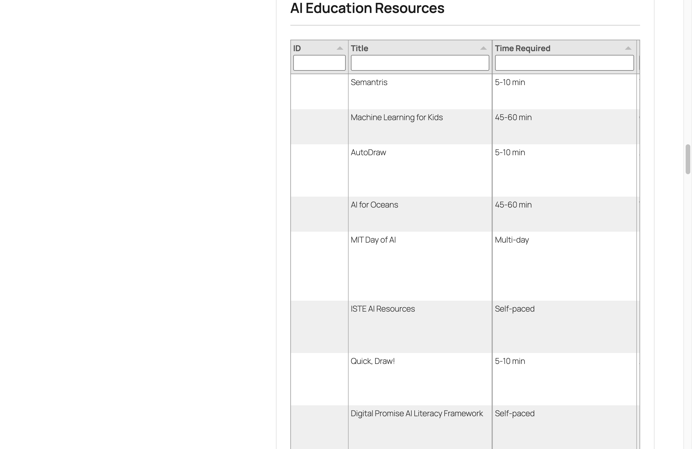
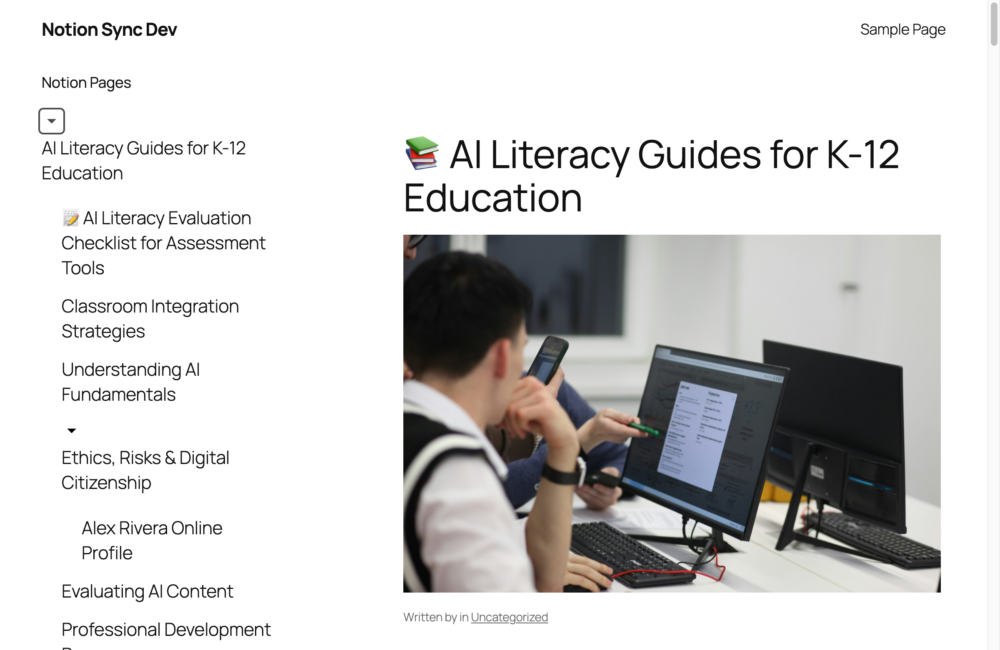

# Screenshots

Visual guide to the Notion Sync for WordPress plugin features.

---

## Published Content Examples

### Database Table View

Interactive Notion databases displayed as filterable, sortable tables with live search and CSV export functionality.

**Features shown:**
- Filterable columns with search
- Sortable data by clicking column headers
- Multi-value fields (tags, categories)
- Rich formatting preserved from Notion
- Responsive table layout

---

### Published Hierarchy

Nested Notion pages maintain their parent-child relationships in WordPress, with an automatically generated collapsible sidebar navigation.

**Features shown:**
- Collapsible sidebar navigation with chevron indicators
- Hierarchical page structure from Notion preserved
- Parent-child relationships maintained
- Page icons (emoji) displayed
- Clean, readable layout compatible with block themes

---

### Auto-Generated Navigation

WordPress navigation menus automatically generated from Notion page structure.

**Features shown:**
- Automatic menu creation from Notion hierarchy
- Multi-level nesting support
- Updates on each sync
- Integration with WordPress menu system

---

## Admin Interface

For admin interface screenshots (Settings, Sync Dashboard, etc.), see the [main README](../README.md#screenshots).

---

## Usage Tips

### Viewing Database Tables

Database tables are fully interactive on the frontend:
- Click column headers to sort
- Use the search box to filter rows
- Export data to CSV using the download button
- Filter by tags or categories using the filter dropdowns

### Working with the Sidebar Navigation

The collapsible sidebar navigation:
- Click chevrons (▶) to expand/collapse sections
- Works with Twenty Twenty-Four and Twenty Twenty-Five themes
- Mobile-responsive design
- Accessible with keyboard navigation and screen readers

To add the sidebar to your site, see the [Block Patterns Guide](features/BLOCK-PATTERNS.md).

---

**[← Back to Main README](../README.md)**
