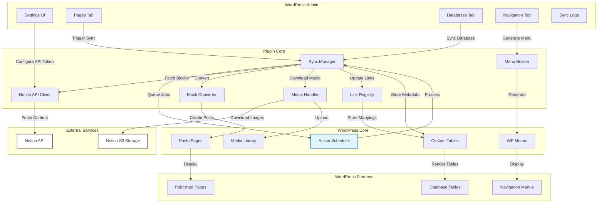
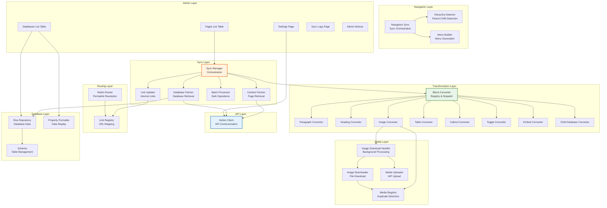
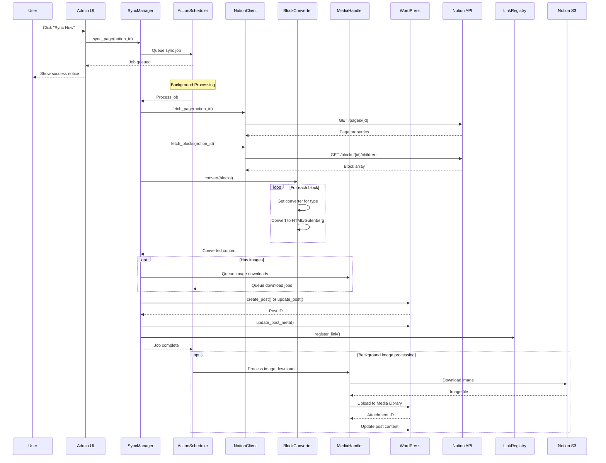
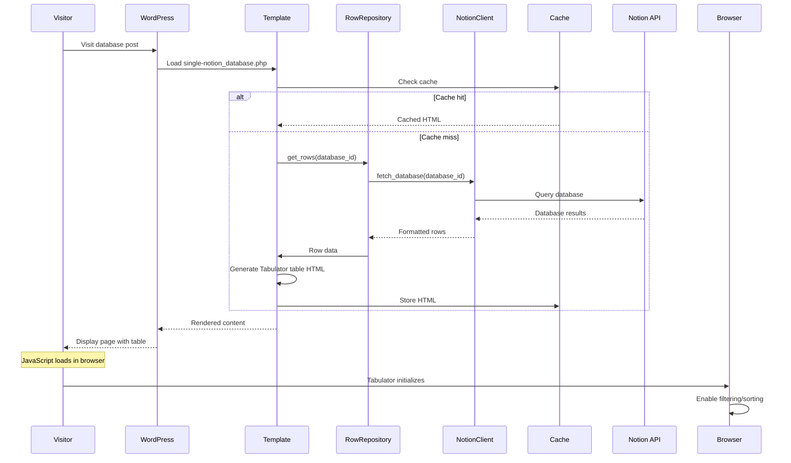

# Notion Sync Architecture Documentation

This directory contains technical architecture documentation for the Notion Sync for WordPress plugin.

## Table of Contents

- [Architecture Overview](#architecture-overview)
- [System Architecture](#system-architecture)
- [Component Architecture](#component-architecture)
- [Data Flow](#data-flow)
- [Key Subsystems](#key-subsystems)
- [Additional Documentation](#additional-documentation)

---

## Architecture Overview

The Notion Sync plugin follows a modular, event-driven architecture that integrates Notion's API with WordPress's core systems. It uses Action Scheduler for background processing and maintains a clean separation between API communication, content transformation, and WordPress integration layers.

### Design Principles

1. **WordPress VIP Compliance** - Performance, security, and code quality standards
2. **Extensibility** - Filter and action hooks throughout the codebase
3. **Testability** - Dependency injection and comprehensive test coverage
4. **Background Processing** - All sync operations use Action Scheduler to prevent timeouts
5. **Idempotency** - Syncing the same content multiple times produces the same result

---

## System Architecture



---

## Component Architecture



---

## Data Flow

### Sync Operation Flow



### Database View Rendering Flow



---

## Key Subsystems

### 1. Sync Manager

**Purpose**: Orchestrates the synchronization process between Notion and WordPress.

**Key Responsibilities**:
- Fetch page properties and content from Notion
- Convert Notion blocks to WordPress content
- Create or update WordPress posts
- Queue background jobs for media downloads
- Update link registry for internal links
- Handle sync errors and logging

**Key Files**:
- `plugin/src/Sync/SyncManager.php` - Main orchestration
- `plugin/src/Sync/ContentFetcher.php` - Page content retrieval
- `plugin/src/Sync/DatabaseFetcher.php` - Database content retrieval
- `plugin/src/Sync/BatchProcessor.php` - Bulk sync operations

### 2. Block Converter

**Purpose**: Transform Notion block format to WordPress Gutenberg blocks or HTML.

**Architecture**: Registry pattern with converter classes for each block type.

**Key Responsibilities**:
- Dispatch blocks to appropriate converters
- Handle unsupported block types gracefully
- Preserve rich text formatting
- Convert links and media references

**Key Files**:
- `plugin/src/Blocks/BlockConverter.php` - Registry and dispatcher
- `plugin/src/Blocks/Converters/*.php` - Individual block converters
- `plugin/src/Blocks/LinkRewriter.php` - Internal link conversion

### 3. Media Handler

**Purpose**: Download and manage media files from Notion.

**Key Responsibilities**:
- Download images from Notion's time-limited S3 URLs
- Upload to WordPress Media Library
- Detect and prevent duplicates
- Queue background processing for large imports
- Update post content with WordPress attachment URLs

**Key Files**:
- `plugin/src/Media/ImageDownloadHandler.php` - Background processing
- `plugin/src/Media/ImageDownloader.php` - File download
- `plugin/src/Media/MediaUploader.php` - WordPress upload
- `plugin/src/Media/MediaRegistry.php` - Duplicate detection

### 4. Navigation System

**Purpose**: Generate WordPress navigation menus from Notion page hierarchy.

**Key Responsibilities**:
- Detect parent-child relationships
- Build hierarchical menu structure
- Preserve manual menu customizations
- Sync menu on page updates

**Key Files**:
- `plugin/src/Hierarchy/HierarchyDetector.php` - Parent-child detection
- `plugin/src/Hierarchy/MenuBuilder.php` - Menu generation
- `plugin/src/Hierarchy/NavigationSync.php` - Sync orchestration

### 5. Link Registry

**Purpose**: Map Notion page IDs to WordPress permalinks for internal link resolution.

**Key Responsibilities**:
- Register Notion ID → WordPress URL mappings
- Generate WordPress-compatible slugs
- Resolve internal links during sync
- Handle link updates when pages are re-synced

**Key Files**:
- `plugin/src/Router/LinkRegistry.php` - URL mapping storage
- `plugin/src/Router/NotionRouter.php` - Permalink resolution

### 6. Database Views

**Purpose**: Display Notion databases as interactive tables on WordPress frontend.

**Key Responsibilities**:
- Fetch database schema and rows from Notion
- Format property values for display
- Generate Tabulator.js configuration
- Cache rendered tables
- Enable filtering, sorting, and search

**Key Files**:
- `plugin/src/Database/RowRepository.php` - Database data access
- `plugin/src/Database/PropertyFormatter.php` - Value formatting
- `plugin/src/Database/DatabasePostType.php` - Custom post type
- `plugin/templates/single-notion_database.php` - Frontend template

---

## Additional Documentation

### Detailed Architecture Docs

- [**ARCHITECTURE-SUMMARY.md**](ARCHITECTURE-SUMMARY.md) - Complete architecture summary with VIP compliance details
- [**project-structure.md**](project-structure.md) - Directory structure and file organization
- [**link-registry-system.md**](link-registry-system.md) - Internal link resolution system
- [**media-sync-integration.md**](media-sync-integration.md) - Media download and upload flow
- [**notion-page-media-types.md**](notion-page-media-types.md) - Notion media type handling

### Quick Reference

- [**QUICK-REFERENCE.md**](QUICK-REFERENCE.md) - Common patterns and code snippets

### Development Guides

- [**Development Guide**](../../DEVELOPMENT.md) - Setup and development workflow
- [**Testing Documentation**](../testing/) - Testing strategies and examples
- [**Getting Started**](../getting-started.md) - User setup guide

---

## Architecture Decisions

### Why Action Scheduler?

- **Non-blocking**: Users don't wait for long-running operations
- **Reliability**: Failed jobs automatically retry with exponential backoff
- **Scalability**: Handles thousands of queued jobs efficiently
- **WordPress-native**: No external dependencies or cron setup required

### Why Custom Database Tables?

- **Performance**: Avoid slow post meta queries at scale
- **Flexibility**: Schema optimized for database row storage
- **VIP Compliance**: Custom tables recommended for large datasets
- **Caching**: Easier to implement query-level caching

### Why Registry Pattern for Block Converters?

- **Extensibility**: Developers can register custom converters via filters
- **Separation of Concerns**: Each converter handles one block type
- **Testability**: Each converter can be unit tested independently
- **Maintainability**: Adding new block types doesn't modify core converter

### Why Link Registry vs. Direct Resolution?

- **Performance**: Pre-computed mappings avoid repeated lookups
- **Reliability**: Links work even if Notion API is temporarily unavailable
- **Consistency**: All links resolve the same way throughout the site
- **Debugging**: Registry provides visibility into all Notion ↔ WordPress mappings

---

## Performance Considerations

### Caching Strategy

1. **Database Views**: Cache rendered tables with TTL based on user role
2. **Notion API Responses**: Transient cache for frequently accessed pages
3. **Link Registry**: Permanent cache with invalidation on sync
4. **Object Cache**: WordPress object cache for all database queries

### Background Processing

All potentially long-running operations use Action Scheduler:
- Page sync with many blocks
- Image downloads
- Database fetches with 100+ rows
- Menu generation

### Rate Limiting

Notion API rate limits:
- ~3 requests per second average
- Burst up to 50 requests per second
- Plugin implements backoff on rate limit errors

---

## Security Architecture

### Authentication & Authorization

- Notion API tokens encrypted at rest
- WordPress capability checks (`manage_options`) for all admin actions
- Nonce verification on all AJAX requests

### Input Sanitization

- All Notion content sanitized before storage
- Rich text converted via `wp_kses_post()`
- URLs validated via `esc_url_raw()`

### Output Escaping

- All admin output escaped via `esc_html()`, `esc_attr()`, `esc_url()`
- Frontend content uses `wp_kses_post()` for allowed HTML
- JavaScript data passed via `wp_localize_script()` with escaping

### SQL Injection Prevention

- All queries use `$wpdb->prepare()` with placeholders
- No direct SQL string concatenation
- Custom table schemas use WordPress conventions

---

## Extensibility Points

### Filters

```php
// Modify block converters
apply_filters('notion_sync_block_converters', $converters);

// Modify field mapping
apply_filters('notion_sync_field_mapping', $mapping, $database_id);

// Modify converted content
apply_filters('notion_sync_converted_content', $content, $blocks);

// Modify link resolution
apply_filters('notion_sync_resolve_link', $url, $notion_id);
```

### Actions

```php
// Before sync starts
do_action('notion_sync_before_sync', $notion_id);

// After sync completes
do_action('notion_sync_after_sync', $post_id, $notion_id);

// After media download
do_action('notion_sync_media_downloaded', $attachment_id, $notion_url);

// After menu generation
do_action('notion_sync_menu_generated', $menu_id);
```

---

## Future Architecture Enhancements

### Planned Improvements

1. **Bi-directional Sync**: WordPress → Notion content updates
2. **Webhook Support**: Real-time sync via Notion webhooks
3. **Multi-workspace**: Support multiple Notion workspaces per site
4. **Advanced Caching**: Redis/Memcached integration for high-traffic sites
5. **GraphQL API**: Headless WordPress support

### Under Consideration

- Incremental sync (only changed blocks)
- Content versioning and rollback
- Conflict resolution UI for bi-directional sync
- Custom field mapping via drag-and-drop UI
- Real-time collaboration indicators

---

## Contributing

When contributing architecture changes:

1. Update relevant architecture documentation
2. Add diagrams for new subsystems
3. Document performance implications
4. Update extensibility examples
5. Include migration guide if breaking changes

See [DEVELOPMENT.md](../../DEVELOPMENT.md) for contribution guidelines.
