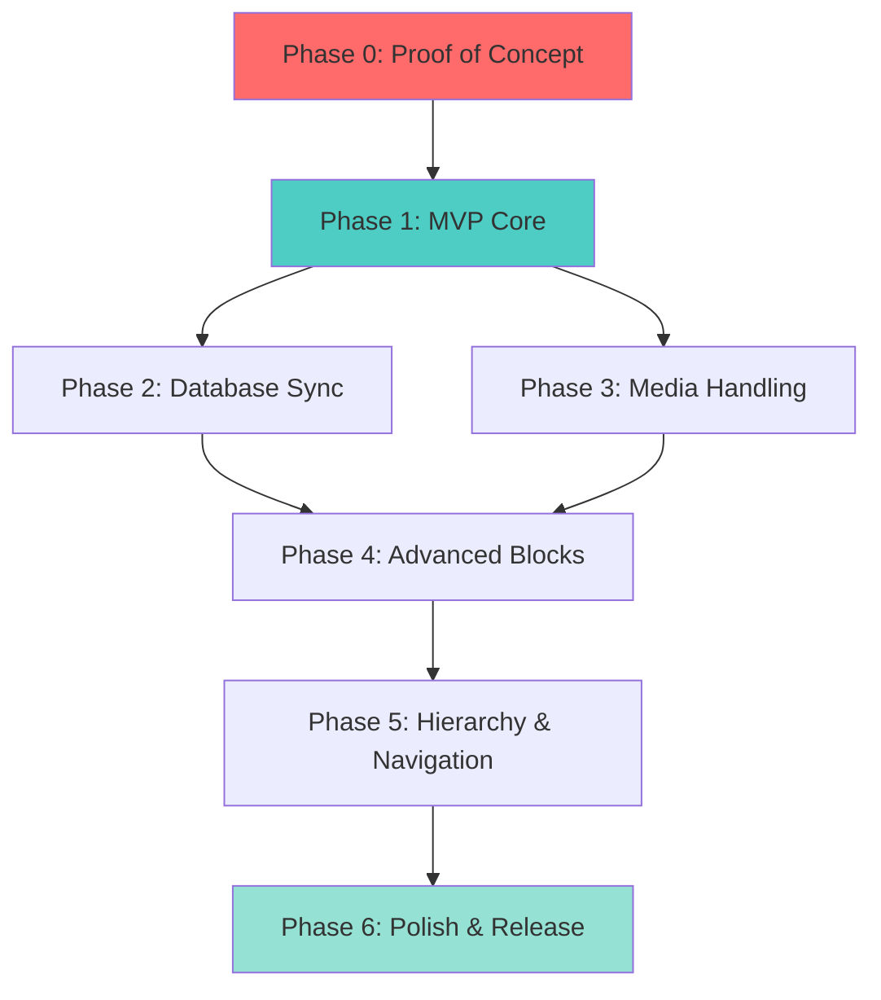

# Main Development Plan

## Project Overview

A WordPress plugin for bi-directional synchronization between Notion and WordPress, following strict KISS principles and incremental delivery. Each phase produces working, visible results that can be demoed to real users.

## Phase Overview

| Phase   | Goal                                     | Complexity | Duration  | Status      |
| ------- | ---------------------------------------- | ---------- | --------- | ----------- |
| Phase 0 | Prove authentication and API access work | S          | 3-5 days  | Not Started |
| Phase 1 | Import a single Notion page to WordPress | M          | 1-2 weeks | Not Started |
| Phase 2 | Sync Notion databases to WordPress posts | M          | 1-2 weeks | Not Started |
| Phase 3 | Download and manage images               | M          | 1 week    | Not Started |
| Phase 4 | Support advanced block types             | L          | 2 weeks   | Not Started |
| Phase 5 | Handle page hierarchy and menus          | M          | 1-2 weeks | Not Started |
| Phase 6 | WordPress.org submission prep            | M          | 1 week    | Not Started |

---

## Phase 0: Proof of Concept (MANDATORY)

**Goal:** User can connect their Notion account, see their workspaces, and verify the connection works.

### Success Criteria

- [ ] Non-technical user can enter API token and see success message
- [ ] Settings page shows user's Notion workspaces/pages
- [ ] Error messages are helpful (e.g., "Invalid token" not "Error 401")
- [ ] User can disconnect and reconnect cleanly
- [ ] All linting passes (WPCS, ESLint, PHPStan level 5)
- [ ] No PHP warnings or JavaScript console errors

### Dependencies

None - this is the first phase.

### Parallel Work Streams

1. **Authentication System** (main branch worktree)
    - Admin settings page
    - Secure token storage
    - Notion API client class
    - Token validation

2. **Development Environment** (separate worktree)
    - Docker Compose setup (WordPress + MySQL)
    - Linting configuration (phpcs, eslint, stylelint)
    - Pre-commit hooks setup
    - Testing framework (PHPUnit)

3. **Basic Admin UI** (separate worktree)
    - Plugin menu structure
    - Settings page layout
    - WordPress admin styles
    - Responsive design

4. **Documentation** (can run parallel)
    - Installation instructions
    - How to get Notion API token
    - Troubleshooting guide

### Deliverables

**Visible to Users:**

- Settings page at WP Admin > Notion Sync
- Input field for API token
- "Connect to Notion" button
- Display of connected workspace name
- List of accessible pages (read-only, no sync yet)
- "Disconnect" button

**Technical:**

- `includes/class-notion-client.php` - API wrapper
- `admin/class-admin-settings.php` - Settings page
- `admin/partials/settings-display.php` - UI template
- Pre-commit hooks configured
- Docker environment running

### Estimated Complexity: S (Small)

This phase is intentionally simple to validate the fundamentals before proceeding.

### Gatekeeping Criteria

**DO NOT PROCEED to Phase 1 until:**

- A non-developer can successfully authenticate
- UI works on mobile devices
- All linting passes
- Zero console errors/warnings
- Can be demoed in under 2 minutes

---

## Phase 1: MVP Core

**Goal:** User can import a single Notion page to WordPress as a post with basic text formatting.

### Success Criteria

- [ ] User selects a Notion page from dropdown
- [ ] Clicks "Sync Now" and sees success message
- [ ] Page appears as WordPress post with correct title
- [ ] Basic blocks work: paragraphs, headings (H1-H3), lists
- [ ] Formatting preserved: bold, italic, links
- [ ] Post is editable in WordPress block editor
- [ ] Re-sync updates existing post (doesn't duplicate)

### Dependencies

**Required from Phase 0:**

- Working Notion API authentication
- Admin settings page foundation
- Development environment with linting

### Parallel Work Streams

1. **Content Fetcher** (main functionality)
    - Fetch page blocks from Notion API
    - Handle pagination (100 blocks at a time)
    - Error handling and retries

2. **Block Converter** (core mapping)
    - Map Notion blocks to Gutenberg blocks
    - Support paragraph, heading, list blocks
    - Preserve text formatting (bold, italic)
    - Convert links

3. **Sync Manager** (orchestration)
    - Coordinate fetch and import
    - Store Notion page ID in post meta
    - Update existing posts on re-sync
    - Status logging

4. **Admin Interface** (user controls)
    - Page selector dropdown
    - "Sync Now" button
    - Progress indicator
    - Success/error messages

### Deliverables

**Visible to Users:**

- Dropdown showing Notion pages
- "Sync to WordPress" button
- Loading spinner during sync
- Success message with link to created post
- Post visible on frontend with correct content

**Technical:**

- `includes/class-content-fetcher.php` - Notion API calls
- `includes/class-block-converter.php` - Block mapping
- `includes/class-sync-manager.php` - Orchestration
- `includes/blocks/` - Individual block handlers
    - `class-paragraph-block.php`
    - `class-heading-block.php`
    - `class-list-block.php`
- Unit tests for block conversion
- Integration test for full sync

### MVP Scope Definition

**What's IN the MVP (v1.0):**

- Single page sync (Notion → WordPress)
- Basic block types (text, headings, lists, links)
- Manual sync trigger
- Update existing posts

**What's OUT (post-1.0):**

- Database sync (Phase 2)
- Images (Phase 3)
- Advanced blocks like callouts, toggles (Phase 4)
- Child pages / hierarchy (Phase 5)
- Bi-directional sync (post-v2.0)
- Webhooks / real-time sync (post-v2.0)
- Custom field mapping (v1.x)

### Estimated Complexity: M (Medium)

This is the critical phase that proves the core concept works.

---

## Phase 2: Database Sync

**Goal:** User can sync a Notion database to WordPress posts with field mapping.

### Success Criteria

- [ ] User can select a Notion database (not just a page)
- [ ] All database entries import as WordPress posts
- [ ] Notion properties map to WordPress fields:
    - Title property → Post title
    - Date property → Post date
    - Select property → Category
    - Multi-select → Tags
- [ ] User can configure field mappings in admin UI
- [ ] Batch import handles 100+ entries without timeout
- [ ] Sync status shows progress (e.g., "Imported 15 of 42 posts")

### Dependencies

**Required from Phase 1:**

- Working single page sync
- Block converter system
- Post creation and update logic

### Parallel Work Streams

1. **Database Querying** (API layer)
    - Query database endpoint
    - Handle pagination
    - Fetch entry properties
    - Fetch entry content blocks

2. **Field Mapping System** (metadata handling)
    - Map Notion properties to WP fields
    - Support common property types
    - Admin UI for mapping configuration
    - Save/load mapping configurations

3. **Batch Processing** (performance)
    - Queue system for large imports
    - Background processing (WP-Cron)
    - Timeout protection
    - Progress tracking

4. **Admin Interface** (configuration)
    - Database selector
    - Field mapping UI (drag-drop or dropdowns)
    - Batch sync controls
    - Progress indicators

### Deliverables

**Visible to Users:**

- Database selector in admin
- Field mapping interface
- "Sync All" button
- Progress bar showing "X of Y posts synced"
- Bulk created posts visible in WP admin

**Technical:**

- `includes/class-database-sync.php` - Database operations
- `includes/class-field-mapper.php` - Property mapping
- `includes/class-batch-processor.php` - Queue handling
- `admin/partials/field-mapping-ui.php` - Mapping interface
- Scheduled cron job for background processing

### Estimated Complexity: M (Medium)

Builds on Phase 1 infrastructure but adds complexity around batch operations.

---

## Phase 3: Media Handling

**Goal:** Images from Notion automatically download to WordPress Media Library.

### Success Criteria

- [ ] Notion image blocks import as WordPress images
- [ ] Images upload to Media Library
- [ ] Images display correctly in posts
- [ ] Alt text and captions preserved (if available)
- [ ] Re-sync doesn't duplicate images
- [ ] File attachments (PDFs) also import
- [ ] Handles 20+ images in single page without timeout

### Dependencies

**Required from Phase 1:**

- Block converter system
- Sync manager

**Optional from Phase 2:**

- Batch processor (helpful for many images)

### Parallel Work Streams

1. **Image Downloader** (core functionality)
    - Download from Notion S3 URLs
    - Handle time-limited URLs
    - Retry failed downloads
    - Support various image formats

2. **Media Library Integration** (WordPress API)
    - Upload to Media Library
    - Set attachment metadata
    - Generate thumbnails
    - Track uploaded files

3. **Deduplication System** (optimization)
    - Hash or ID-based tracking
    - Avoid duplicate uploads
    - Update references in content
    - Clean up orphaned images

4. **File Support** (bonus)
    - Download PDFs, docs
    - Upload to Media Library
    - Link in post content

### Deliverables

**Visible to Users:**

- Images appear in synced posts
- Images visible in Media Library
- Correct alt text on images
- File download links work

**Technical:**

- `includes/class-media-downloader.php` - Download logic
- `includes/class-media-uploader.php` - WP Media Library
- `includes/class-media-tracker.php` - Deduplication
- `includes/blocks/class-image-block.php` - Image converter
- `includes/blocks/class-file-block.php` - File converter

### Estimated Complexity: M (Medium)

Well-defined scope but requires careful handling of external resources.

---

## Phase 4: Advanced Blocks

**Goal:** Support complex Notion block types (callouts, toggles, quotes, code, tables).

### Success Criteria

- [ ] Quote blocks → WordPress quote blocks
- [ ] Callout blocks → Custom styled blocks
- [ ] Toggle blocks → Expandable sections
- [ ] Code blocks → Syntax highlighted code
- [ ] Tables → WordPress table blocks
- [ ] Column layouts preserved
- [ ] Embed blocks (YouTube, Twitter) work
- [ ] Graceful fallback for unsupported blocks

### Dependencies

**Required from Phase 1:**

- Block converter infrastructure
- Extensibility hooks

### Parallel Work Streams

1. **Quote & Callout Blocks** (simpler blocks)
    - Quote block converter
    - Callout block converter (custom Gutenberg block)
    - Icon support for callouts
    - Styling

2. **Code & Toggle Blocks** (medium complexity)
    - Code block with syntax highlighting
    - Toggle/accordion block
    - Language detection for code
    - Nested content in toggles

3. **Tables & Columns** (complex layout)
    - Table block converter
    - Column layout handler
    - Responsive tables
    - Complex cell content

4. **Embeds & Fallbacks** (edge cases)
    - Embed block detection
    - YouTube, Twitter, etc. embeds
    - Bookmark blocks
    - Unsupported block warnings

### Deliverables

**Visible to Users:**

- All Notion block types render correctly
- Custom blocks for Notion-specific features
- Code blocks with syntax highlighting
- Tables with proper formatting

**Technical:**

- `includes/blocks/class-quote-block.php`
- `includes/blocks/class-callout-block.php`
- `includes/blocks/class-toggle-block.php`
- `includes/blocks/class-code-block.php`
- `includes/blocks/class-table-block.php`
- `includes/blocks/class-embed-block.php`
- `includes/blocks/class-fallback-block.php`
- Custom Gutenberg blocks (JS/React)
- Block styles (CSS)

### Estimated Complexity: L (Large)

Many block types with varying complexity.

---

## Phase 5: Hierarchy & Navigation

**Goal:** Sync page hierarchies and automatically generate WordPress navigation menus.

### Success Criteria

- [ ] Child pages in Notion sync as child pages in WordPress
- [ ] Parent-child relationships preserved
- [ ] WordPress menu auto-generated from structure
- [ ] Internal Notion links convert to WordPress permalinks
- [ ] Menu updates on re-sync (adds new, removes deleted)
- [ ] User can choose which menu to update
- [ ] Works with 3+ levels of nesting

### Dependencies

**Required from Phase 1:**

- Page sync functionality
- Post meta storage (for page IDs)

### Parallel Work Streams

1. **Hierarchy Detection** (structure mapping)
    - Detect child pages in Notion
    - Recursive page fetching
    - Build page tree structure
    - Depth limit handling

2. **WordPress Hierarchy** (WP integration)
    - Set parent page in WordPress
    - Create page relationships
    - Handle orphaned pages
    - Page order/sequence

3. **Menu Generation** (navigation)
    - Create/update WP menus
    - Add pages in correct order
    - Handle nested items
    - Menu item metadata

4. **Link Conversion** (internal links)
    - Detect Notion page links
    - Map to WordPress permalinks
    - Update content after sync
    - Handle broken links

### Deliverables

**Visible to Users:**

- Nested pages appear correctly in WP admin
- Navigation menu automatically created
- Menu reflects Notion hierarchy
- Internal links work between pages

**Technical:**

- `includes/class-hierarchy-sync.php` - Page tree handling
- `includes/class-menu-generator.php` - Menu creation
- `includes/class-link-converter.php` - Link transformation
- Menu assignment interface in admin
- Recursive sync support

### Estimated Complexity: M (Medium)

Clear requirements but needs careful handling of relationships.

---

## Phase 6: Polish & Release

**Goal:** Plugin is ready for WordPress.org submission and public release.

### Success Criteria

- [ ] All WordPress.org requirements met
- [ ] Complete readme.txt file
- [ ] Screenshots and banner images
- [ ] Internationalization ready (i18n)
- [ ] Security audit passed
- [ ] Performance testing completed
- [ ] User documentation written
- [ ] 5+ real users successfully tested plugin

### Dependencies

**Required from All Previous Phases:**

- All core features working
- No critical bugs
- Linting passes

### Parallel Work Streams

1. **WordPress.org Compliance** (requirements)
    - Security audit (nonces, sanitization, escaping)
    - GPL licensing compliance
    - readme.txt formatting
    - Version number scheme

2. **Assets & Documentation** (presentation)
    - Plugin banner (772x250, 1544x500)
    - Plugin icon (128x128, 256x256)
    - Screenshots (1200px wide)
    - Video demo (optional)
    - User guide
    - FAQ section

3. **Internationalization** (i18n)
    - Text domain setup
    - All strings wrapped in translation functions
    - POT file generation
    - RTL support testing

4. **Testing & QA** (quality assurance)
    - Beta testing with real users
    - WordPress version compatibility (6.0+)
    - PHP version compatibility (7.4+)
    - Theme compatibility testing
    - Performance benchmarking
    - Security scanning

### Deliverables

**Visible to Users:**

- Polished admin interface
- Complete documentation
- Professional plugin listing

**Technical:**

- readme.txt (WordPress.org format)
- LICENSE.txt (GPL v2+)
- assets/ directory (banners, icons, screenshots)
- languages/ directory (.pot file)
- Security fixes and hardening
- Performance optimizations
- SVN repository setup
- Tagged v1.0.0 release

### Estimated Complexity: M (Medium)

Mostly checklist items but requires attention to detail.

---

## Critical Path

The critical path through the phases is:

**Phase 0 → Phase 1 → Phase 3 → Phase 6**

This is the minimum viable path to a releasable v1.0:

1. Prove it works (Phase 0)
2. Sync basic content (Phase 1)
3. Handle images (Phase 3)
4. Release prep (Phase 6)

Phases 2, 4, and 5 can be deferred to v1.1+ if needed.

---

## MVP Definition

**Minimum Viable Product (v1.0) includes:**

- Single page sync (Notion → WordPress)
- Basic blocks: paragraphs, headings, lists, links, images
- Manual sync trigger
- Media Library integration
- Update existing posts
- WordPress.org compliant

**Can be deferred to v1.x:**

- Database sync (Phase 2)
- Advanced blocks (Phase 4)
- Hierarchy/menus (Phase 5)
- Scheduled polling
- Custom field mapping
- SEO plugin integration

**Can be deferred to v2.0+:**

- Bi-directional sync (WordPress → Notion)
- Webhook support
- Real-time sync
- Dry run mode
- WP-CLI commands

---

## Development Principles Reminder

### Each Phase Must:

- Produce working, visible UI (no backend-only phases)
- Be completable in 1-2 weeks maximum
- Pass all linting before moving forward
- Be demoable to a non-technical user
- Have clear, testable acceptance criteria

### Each Phase Should NOT:

- Build entire infrastructure before using it
- Have files over 500 lines
- Skip testing "to save time"
- Have vague success criteria
- Block all other work (use parallel streams)

### Definition of Done (Every Phase):

- [ ] Code written and linted
- [ ] Tests written and passing
- [ ] UI functional and tested
- [ ] No console errors or PHP warnings
- [ ] Documentation updated
- [ ] Can demo in under 5 minutes
- [ ] Reviewed (minimum self-review)

---

## Next Steps

1. **Start Phase 0 immediately**
2. Set up three parallel worktrees:
    - `main/phase-0-auth` - Authentication system
    - `main/phase-0-environment` - Dev environment
    - `main/phase-0-admin` - Admin UI
3. Daily standups focusing on:
    - What shipped yesterday?
    - What ships today?
    - Any blockers?
4. **Do not proceed to Phase 1 until Phase 0 gatekeeping criteria are met**

---

## Version Roadmap

- **v0.1-v0.9**: Development/beta releases for each phase
- **v1.0**: First stable release (Phase 0 + Phase 1 + Phase 3 + Phase 6)
- **v1.1**: Add database sync (Phase 2)
- **v1.2**: Add advanced blocks (Phase 4)
- **v1.3**: Add hierarchy/menus (Phase 5)
- **v1.4+**: Incremental improvements, bug fixes
- **v2.0**: Bi-directional sync, webhooks (major features)

Each version must be fully functional and releasable - no "alpha" builds with half-working features.
