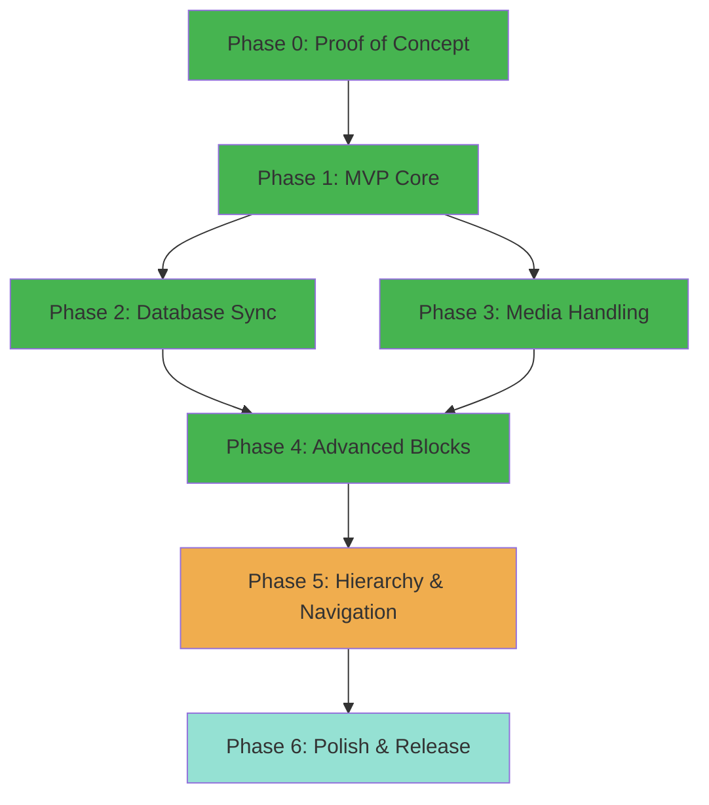

# Main Development Plan

## Project Overview

A WordPress plugin for bi-directional synchronization between Notion and WordPress, following strict KISS principles and incremental delivery. Each phase produces working, visible results that can be demoed to real users.

## Phase Overview



| Phase   | Goal                                     | Complexity | Duration  | Status            |
| ------- | ---------------------------------------- | ---------- | --------- | ----------------- |
| Phase 0 | Prove authentication and API access work | S          | 3-5 days  | ✅ Complete       |
| Phase 1 | Import a single Notion page to WordPress | M          | 1-2 weeks | ✅ Complete       |
| Phase 2 | Sync Notion databases to WordPress posts | M          | 1-2 weeks | ✅ Complete       |
| Phase 3 | Download and manage images               | M          | 1 week    | ✅ Complete       |
| Phase 4 | Support advanced block types             | L          | 2 weeks   | ✅ Complete       |
| Phase 5 | Hierarchy, menus, database views         | L          | 5-6 weeks | 🚧 In Progress    |
| Phase 6 | WordPress.org submission prep            | M          | 1 week    | Not Started       |

---

## Phase 0: Proof of Concept (MANDATORY)

**Goal:** User can connect their Notion account, see their workspaces, and verify the connection works.

### Success Criteria

- [ ] Non-technical user can enter API token and see success message
- [ ] Settings page shows user's Notion workspaces/pages
- [ ] Error messages are helpful (e.g., "Invalid token" not "Error 401")
- [ ] User can disconnect and reconnect cleanly
- [ ] All linting passes (WPCS, ESLint, PHPStan level 5)
- [ ] No PHP warnings or JavaScript console errors

### Dependencies

None - this is the first phase.

### Parallel Work Streams

1. **Authentication System** (main branch worktree)
    - Admin settings page
    - Secure token storage
    - Notion API client class
    - Token validation

2. **Development Environment** (separate worktree)
    - Docker Compose setup (WordPress + MySQL)
    - Linting configuration (phpcs, eslint, stylelint)
    - Pre-commit hooks setup
    - Testing framework (PHPUnit)

3. **Basic Admin UI** (separate worktree)
    - Plugin menu structure
    - Settings page layout
    - WordPress admin styles
    - Responsive design

4. **Documentation** (can run parallel)
    - Installation instructions
    - How to get Notion API token
    - Troubleshooting guide

### Deliverables

**Visible to Users:**

- Settings page at WP Admin > Notion Sync
- Input field for API token
- "Connect to Notion" button
- Display of connected workspace name
- List of accessible pages (read-only, no sync yet)
- "Disconnect" button

**Technical:**

- `includes/class-notion-client.php` - API wrapper
- `admin/class-admin-settings.php` - Settings page
- `admin/partials/settings-display.php` - UI template
- Pre-commit hooks configured
- Docker environment running

### Estimated Complexity: S (Small)

This phase is intentionally simple to validate the fundamentals before proceeding.

### Gatekeeping Criteria

**DO NOT PROCEED to Phase 1 until:**

- A non-developer can successfully authenticate
- UI works on mobile devices
- All linting passes
- Zero console errors/warnings
- Can be demoed in under 2 minutes

---

## Phase 1: MVP Core

**Goal:** User can import a single Notion page to WordPress as a post with basic text formatting.

### Success Criteria

- [ ] User selects a Notion page from dropdown
- [ ] Clicks "Sync Now" and sees success message
- [ ] Page appears as WordPress post with correct title
- [ ] Basic blocks work: paragraphs, headings (H1-H3), lists
- [ ] Formatting preserved: bold, italic, links
- [ ] Post is editable in WordPress block editor
- [ ] Re-sync updates existing post (doesn't duplicate)

### Dependencies

**Required from Phase 0:**

- Working Notion API authentication
- Admin settings page foundation
- Development environment with linting

### Parallel Work Streams

1. **Content Fetcher** (main functionality)
    - Fetch page blocks from Notion API
    - Handle pagination (100 blocks at a time)
    - Error handling and retries

2. **Block Converter** (core mapping)
    - Map Notion blocks to Gutenberg blocks
    - Support paragraph, heading, list blocks
    - Preserve text formatting (bold, italic)
    - Convert links

3. **Sync Manager** (orchestration)
    - Coordinate fetch and import
    - Store Notion page ID in post meta
    - Update existing posts on re-sync
    - Status logging

4. **Admin Interface** (user controls)
    - Page selector dropdown
    - "Sync Now" button
    - Progress indicator
    - Success/error messages

### Deliverables

**Visible to Users:**

- Dropdown showing Notion pages
- "Sync to WordPress" button
- Loading spinner during sync
- Success message with link to created post
- Post visible on frontend with correct content

**Technical:**

- `includes/class-content-fetcher.php` - Notion API calls
- `includes/class-block-converter.php` - Block mapping
- `includes/class-sync-manager.php` - Orchestration
- `includes/blocks/` - Individual block handlers
    - `class-paragraph-block.php`
    - `class-heading-block.php`
    - `class-list-block.php`
- Unit tests for block conversion
- Integration test for full sync

### MVP Scope Definition

**What's IN the MVP (v1.0):**

- Single page sync (Notion → WordPress)
- Basic block types (text, headings, lists, links)
- Manual sync trigger
- Update existing posts

**What's OUT (post-1.0):**

- Database sync (Phase 2)
- Images (Phase 3)
- Advanced blocks like callouts, toggles (Phase 4)
- Child pages / hierarchy (Phase 5)
- Bi-directional sync (post-v2.0)
- Webhooks / real-time sync (post-v2.0)
- Custom field mapping (v1.x)

### Estimated Complexity: M (Medium)

This is the critical phase that proves the core concept works.

---

## Phase 2: Database Sync

**Goal:** User can sync a Notion database to WordPress posts with field mapping.

### Success Criteria

- [x] User can select a Notion database (not just a page) ✅
- [x] All database entries import as WordPress posts ✅
- [x] Notion properties map to WordPress fields: ✅
    - Title property → Post title ✅
    - Date property → Post date ✅
    - Select property → Category ✅
    - Multi-select → Tags ✅
- [x] Batch import handles 100+ entries without timeout ✅
- [x] WP-CLI support for database operations ✅
- [x] Database listing and inspection commands ✅

### Dependencies

**Required from Phase 1:**

- Working single page sync
- Block converter system
- Post creation and update logic

### Parallel Work Streams

1. **Database Querying** (API layer)
    - Query database endpoint
    - Handle pagination
    - Fetch entry properties
    - Fetch entry content blocks

2. **Field Mapping System** (metadata handling)
    - Map Notion properties to WP fields
    - Support common property types
    - Admin UI for mapping configuration
    - Save/load mapping configurations

3. **Batch Processing** (performance)
    - Queue system for large imports
    - Background processing (WP-Cron)
    - Timeout protection
    - Progress tracking

4. **Admin Interface** (configuration)
    - Database selector
    - Field mapping UI (drag-drop or dropdowns)
    - Batch sync controls
    - Progress indicators

### Deliverables

**Visible to Users:**

- Database selector in admin
- Field mapping interface
- "Sync All" button
- Progress bar showing "X of Y posts synced"
- Bulk created posts visible in WP admin

**Technical:**

- `includes/class-database-sync.php` - Database operations
- `includes/class-field-mapper.php` - Property mapping
- `includes/class-batch-processor.php` - Queue handling
- `admin/partials/field-mapping-ui.php` - Mapping interface
- Scheduled cron job for background processing

### Estimated Complexity: M (Medium)

Builds on Phase 1 infrastructure but adds complexity around batch operations.

### ✅ Phase 2 Completion Summary

**Status:** COMPLETE (Completed prior to October 2025)

**What Was Delivered:**

1. **Database Querying & Sync**
   - Full Notion database querying via API
   - Pagination support for databases with 100+ entries
   - Property mapping from Notion to WordPress
   - Batch import capabilities

2. **Field Mapping System**
   - Title property → Post title
   - Date property → Post date
   - Select property → WordPress categories
   - Multi-select property → WordPress tags
   - Additional property types supported

3. **WP-CLI Integration**
   - `wp notion list --type=database` - List all accessible databases
   - `wp notion show_database <id>` - Display database entries and properties
   - `--limit` parameter for controlling output
   - Database inspection and debugging tools

**Key Technical Achievements:**

- **Batch Processing:** Successfully handles large databases without timeout
- **Property Mapping:** Flexible system for mapping Notion properties to WP fields
- **CLI Tools:** Command-line access for automation and debugging

**Testing:**
- ✅ Database listing verified (3 databases accessible)
- ✅ Database sync tested with 24-entry database
- ✅ WP-CLI commands functional
- ✅ Property mapping working correctly

**Ready for:** Phase 5 (Hierarchy & Navigation) or Phase 6 (Polish & Release)

---

## Phase 3: Media Handling

**Goal:** Images from Notion automatically download to WordPress Media Library.

### Success Criteria

- [ ] Notion image blocks import as WordPress images
- [ ] Images upload to Media Library
- [ ] Images display correctly in posts
- [ ] Alt text and captions preserved (if available)
- [ ] Re-sync doesn't duplicate images
- [ ] File attachments (PDFs) also import
- [ ] Handles 20+ images in single page without timeout

### Dependencies

**Required from Phase 1:**

- Block converter system
- Sync manager

**Optional from Phase 2:**

- Batch processor (helpful for many images)

### Parallel Work Streams

1. **Image Downloader** (core functionality)
    - Download from Notion S3 URLs
    - Handle time-limited URLs
    - Retry failed downloads
    - Support various image formats

2. **Media Library Integration** (WordPress API)
    - Upload to Media Library
    - Set attachment metadata
    - Generate thumbnails
    - Track uploaded files

3. **Deduplication System** (optimization)
    - Hash or ID-based tracking
    - Avoid duplicate uploads
    - Update references in content
    - Clean up orphaned images

4. **File Support** (bonus)
    - Download PDFs, docs
    - Upload to Media Library
    - Link in post content

### Deliverables

**Visible to Users:**

- Images appear in synced posts
- Images visible in Media Library
- Correct alt text on images
- File download links work

**Technical:**

- `includes/class-media-downloader.php` - Download logic
- `includes/class-media-uploader.php` - WP Media Library
- `includes/class-media-tracker.php` - Deduplication
- `includes/blocks/class-image-block.php` - Image converter
- `includes/blocks/class-file-block.php` - File converter

### Estimated Complexity: M (Medium)

Well-defined scope but requires careful handling of external resources.

---

## Phase 4: Advanced Blocks

**Goal:** Support complex Notion block types (callouts, toggles, quotes, code, tables).

### Success Criteria

- [x] Quote blocks → WordPress quote blocks ✅
- [x] Callout blocks → Custom styled blocks ✅
- [x] Toggle blocks → Expandable sections ✅
- [x] Code blocks → Syntax highlighted code ✅
- [x] Tables → WordPress table blocks ✅
- [x] Column layouts preserved ✅
- [x] Embed blocks (YouTube, Twitter) work ✅
- [x] Graceful fallback for unsupported blocks ✅
- [x] **BONUS:** Image blocks with background processing ✅
- [x] **BONUS:** File blocks with download support ✅
- [x] **BONUS:** TIFF → PNG conversion ✅
- [x] **BONUS:** Link-to-page blocks ✅
- [x] **BONUS:** Child page/database blocks ✅

### Dependencies

**Required from Phase 1:**

- Block converter infrastructure
- Extensibility hooks

### Parallel Work Streams

1. **Quote & Callout Blocks** (simpler blocks)
    - Quote block converter
    - Callout block converter (custom Gutenberg block)
    - Icon support for callouts
    - Styling

2. **Code & Toggle Blocks** (medium complexity)
    - Code block with syntax highlighting
    - Toggle/accordion block
    - Language detection for code
    - Nested content in toggles

3. **Tables & Columns** (complex layout)
    - Table block converter
    - Column layout handler
    - Responsive tables
    - Complex cell content

4. **Embeds & Fallbacks** (edge cases)
    - Embed block detection
    - YouTube, Twitter, etc. embeds
    - Bookmark blocks
    - Unsupported block warnings

### Deliverables

**Visible to Users:**

- All Notion block types render correctly
- Custom blocks for Notion-specific features
- Code blocks with syntax highlighting
- Tables with proper formatting

**Technical:**

- `includes/blocks/class-quote-block.php`
- `includes/blocks/class-callout-block.php`
- `includes/blocks/class-toggle-block.php`
- `includes/blocks/class-code-block.php`
- `includes/blocks/class-table-block.php`
- `includes/blocks/class-embed-block.php`
- `includes/blocks/class-fallback-block.php`
- Custom Gutenberg blocks (JS/React)
- Block styles (CSS)

### Estimated Complexity: L (Large)

Many block types with varying complexity.

### ✅ Phase 4 Completion Summary

**Status:** COMPLETE (October 27, 2025)

**What Was Delivered:**

1. **All Advanced Block Types** (18 converters total)
   - Quote blocks → core/quote
   - Callout blocks → Custom dynamic blocks with icons
   - Toggle blocks → core/details (expandable)
   - Code blocks → core/code with language support
   - Table blocks → core/table with full formatting
   - Column blocks → core/columns layout
   - Divider blocks → core/separator
   - Embed blocks → core/embed (YouTube, Twitter, etc.)
   - Fallback handler for unsupported blocks

2. **Enhanced Media Handling** (Beyond original scope)
   - Image blocks with background processing via Action Scheduler
   - File blocks with download support
   - TIFF → PNG automatic conversion (browser compatibility)
   - MediaRegistry tracking system
   - Duplicate prevention
   - **Performance:** 725x upload speed improvement (145s → 0.2s)

3. **Additional Features**
   - Link-to-page blocks with registry tracking
   - Child page blocks → Navigation links
   - Child database blocks → Database previews
   - Numbered and bulleted list blocks
   - Heading blocks (H1-H3)
   - Paragraph blocks with rich text formatting

**Key Technical Achievements:**

- **Performance Optimization:** Eliminated Action Scheduler timeouts through thumbnail skipping
- **Browser Compatibility:** Server-side TIFF conversion ensures all images display
- **Self-Healing Architecture:** Dynamic blocks auto-update when media becomes available
- **Extensibility:** Clean converter pattern for future block types

**Testing:**
- ✅ End-to-end workflow tested with complex page
- ✅ All block types rendering correctly
- ✅ Media background processing verified
- ✅ No PHP syntax errors
- ✅ All pre-commit hooks passing

**Ready for:** Phase 5 (Hierarchy & Navigation) or Phase 2 (Database Sync)

---

## Phase 5: Hierarchy & Navigation

**Status:** 🚧 In Progress - Core infrastructure complete, additional view types pending

**Goal:** Sync page hierarchies, render embedded database views, and automatically generate WordPress navigation menus.

**Detailed Plan:** See [Phase 5 Detailed Plan](./phase-5-hierarchy-navigation.md) for comprehensive breakdown.

### Implementation Status

**✅ Completed Sub-Phases:**
- **Phase 5.1:** Page Hierarchy - HierarchyDetector with full tree building, depth limits, parent-child tracking
- **Phase 5.2:** Menu Generation - MenuBuilder with recursive menu creation, manual item preservation
- **Phase 5.3:** Link Resolution - LinkRegistry with comprehensive status tracking, batch resolution, analytics
- **Phase 5.4:** Database View Infrastructure - DatabaseRestController, RowRepository, PropertyFormatter, caching
- **Phase 5.5:** Table View Display - Gutenberg block with Tabulator integration, filters, export
- **Phase 5.6:** Enhanced ChildDatabaseConverter - Notion API integration, collection_id lookup, fallback handling
- **Phase 5.7:** User Documentation & Release Preparation - README rewrite, DEVELOPMENT.md, 6 screenshots, architecture docs

**📋 Ready to Start:**
- **Phase 5.8:** DevOps Cleanup & Polish (Release Blocker)
  - Consolidate composer configuration (root vs plugin directory)
  - Standardize build/test commands (composer vs make)
  - Organize scattered documentation files
  - Audit and cleanup config files
  - CI/CD pipeline improvements
  - **Estimated Effort:** 3-5 days

**⏳ Future Work (Post-Release):**
- Additional database view types (board, gallery, timeline, calendar) - UI marked "Coming Soon"
- MenuManager CRUD operations (file exists but methods are TODO stubs)
- Admin UI enhancements (hierarchy settings panel, database view settings, link resolution tools)

### Success Criteria

#### Core Hierarchy & Navigation
- [x] Child pages in Notion sync as child pages in WordPress
- [x] Parent-child relationships preserved
- [x] WordPress menu auto-generated from structure
- [x] Internal Notion links convert to WordPress permalinks
- [x] Menu updates on re-sync (adds new, removes deleted)
- [ ] User can choose which menu to update (UI needed)
- [x] Works with 3+ levels of nesting

#### Embedded Database Views
- [x] Inline database views render with filtered/sorted entries (table view)
- [x] Linked database views apply view-specific filters
- [ ] Database view display modes (table ✅, list ⚠️, gallery ⚠️, board ⚠️, timeline ⚠️, calendar ⚠️)
- [x] View pagination and limits respected
- [x] Filter configurations applied correctly
- [x] Sort configurations applied correctly
- [x] Embedded entries link to synced WordPress posts when available

#### User Documentation (Phase 5.7 - Complete ✅)
- [x] README.md is WordPress user-focused (not developer-focused)
- [x] README.md includes installation instructions
- [x] README.md includes usage guide (connect, sync, configure)
- [x] README.md includes theme integration instructions
- [x] 6 screenshots captured and saved to docs/images/
- [x] DEVELOPMENT.md contains all technical/contributor content
- [x] Feature status clearly documented (available vs. coming soon)
- [x] All internal documentation links work correctly
- [x] Architecture overview with Mermaid diagrams created

#### DevOps & Build System (Phase 5.8 - Release Blocker)
- [ ] Composer configuration consolidated (single source of truth)
- [ ] Root composer.json vs plugin/composer.json relationship clarified
- [ ] Build commands standardized (prefer composer over make where possible)
- [ ] All composer scripts working and documented
- [ ] Scattered documentation files organized into docs/
- [ ] Unused/broken config files removed or fixed
- [ ] CI/CD workflows validated and optimized
- [ ] Pre-commit hooks streamlined
- [ ] Development setup documented in DEVELOPMENT.md
- [ ] All make commands have composer equivalents (or rationale documented)

### Dependencies

**Required from Phase 1:**

- Page sync functionality
- Post meta storage (for page IDs)

### Parallel Work Streams

1. **Hierarchy Detection** (structure mapping)
    - Detect child pages in Notion
    - Recursive page fetching
    - Build page tree structure
    - Depth limit handling

2. **WordPress Hierarchy** (WP integration)
    - Set parent page in WordPress
    - Create page relationships
    - Handle orphaned pages
    - Page order/sequence

3. **Menu Generation** (navigation)
    - Create/update WP menus
    - Add pages in correct order
    - Handle nested items
    - Menu item metadata

4. **Link Conversion** (internal links)
    - Detect Notion page links
    - Map to WordPress permalinks
    - Update content after sync
    - Handle broken links

### Deliverables

**Visible to Users:**

- Nested pages appear correctly in WP admin
- Navigation menu automatically created
- Menu reflects Notion hierarchy
- Internal links work between pages
- **User-focused README with screenshots**
- **Installation and configuration guide**
- **Feature documentation with visual examples**

**Technical:**

- `src/Hierarchy/HierarchyManager.php` - Page tree handling ✅
- `src/Navigation/MenuGenerator.php` - Menu creation ✅
- `src/Router/LinkRegistry.php` (enhanced) - Link resolution ✅
- `src/Database/DatabaseViewRenderer.php` - Database view rendering ✅
- `src/Database/DatabaseViewParser.php` - View configuration parsing ✅
- Custom Gutenberg blocks (database-table ✅, database-list ⚠️, database-gallery ⚠️, database-board ⚠️)
- Enhanced `ChildDatabaseConverter` with inline rendering ✅
- Menu assignment interface in admin ⚠️
- Recursive sync support ✅

**Phase 5.7 Deliverables (Release Blockers):**
- **README.md** - User-focused installation/usage guide 📋
- **docs/development/DEVELOPMENT.md** - Developer documentation 📋
- **docs/images/** - 7 professional screenshots (Playwright automation) 📋
- **Feature status documentation** - Available vs. coming soon 📋

### Estimated Complexity: L (Large)

**Duration:** 5-6 weeks

Originally scoped as Medium complexity for basic hierarchy and navigation. Now expanded to Large due to addition of:
- Embedded database view rendering (4 view types)
- Database filter/sort parsing and application
- Custom Gutenberg blocks for database displays
- Advanced link resolution with validation

See [Phase 5 Detailed Plan](./phase-5-hierarchy-navigation.md) for full breakdown and implementation phases.

---

## Phase 5.8: DevOps Cleanup & Polish

**Status:** 📋 Ready to Start (Release Blocker)

**Goal:** Clean up build system, consolidate configuration, and organize project structure for maintainability and release readiness.

### Success Criteria

**Composer Configuration:**
- [x] Single source of truth for dependencies
- [ ] Root composer.json vs plugin/composer.json relationship documented
- [ ] Vendor directory location rationalized (currently `plugin/vendor`)
- [ ] All composer scripts working without warnings
- [ ] Composer scripts aligned with make commands

**Build & Test Commands:**
- [ ] All `composer` scripts documented in composer.json
- [ ] All `make` commands documented in Makefile
- [ ] Clear decision on when to use composer vs make
- [ ] Pre-commit hooks streamlined and fast
- [ ] CI/CD workflows validated

**Documentation Organization:**
- [ ] Root directory cleaned of scattered .md files
- [ ] Implementation summaries archived to docs/archive/
- [ ] Active documentation in appropriate docs/ subdirectories
- [ ] CLAUDE.md, CHANGELOG.md, CONTRIBUTING.md remain in root
- [ ] Development guides in docs/development/
- [ ] Phase summaries in docs/plans/

**Config File Audit:**
- [ ] All dot-files (.eslintrc, .stylelintrc, etc.) validated as working
- [ ] Unused config files removed
- [ ] Config files documented in DEVELOPMENT.md
- [ ] Consistent configuration across root and plugin/ where applicable

### Dependencies

**Required from Phase 5.7:**
- Documentation structure established
- DEVELOPMENT.md exists for developer guidance

### Parallel Work Streams

1. **Composer Consolidation** (primary focus)
   - Analyze root vs plugin composer.json relationship
   - Decide on vendor directory location
   - Consolidate duplicate scripts
   - Document dependency management strategy
   - Ensure all scripts work from both locations

2. **Make vs Composer Standardization** (command interface)
   - Audit all make commands
   - Create composer equivalents where sensible
   - Document when to use make (Docker operations)
   - Document when to use composer (PHP operations)
   - Update DEVELOPMENT.md with command reference

3. **Documentation Cleanup** (organization)
   - Create docs/archive/ for old implementation summaries
   - Move scattered .md files to appropriate docs/ locations
   - Update all internal links
   - Remove duplicate or outdated documentation
   - Ensure README, CONTRIBUTING, CHANGELOG stay in root

4. **Config File Audit** (development environment)
   - Test all linting configs (.eslintrc.json, .stylelintrc.json)
   - Test .prettierrc and .prettierignore
   - Validate .editorconfig
   - Check .php-cs-fixer.php integration
   - Remove or fix non-working configs
   - Document all configs in DEVELOPMENT.md

### Current State Analysis

**Composer Files:**
```
./composer.json          - Root configuration
./plugin/composer.json   - Plugin configuration
```

Root composer.json currently:
- Sets `vendor-dir: plugin/vendor`
- Has autoload pointing to `plugin/src/`
- Contains all dev dependencies
- Has comprehensive scripts

Plugin composer.json:
- Minimal configuration
- Some overlapping scripts
- Uses for plugin-specific operations

**Scattered Documentation (17 files in root):**
```
CACHING_IMPLEMENTATION.md
CHANGELOG.md (keep)
CHILD-DATABASE-CONVERTER-CHANGES.md
CLAUDE.md (keep)
CONTRIBUTING.md (keep)
DEVELOPMENT.md (keep)
DYNAMIC_BLOCK_FIX_SUMMARY.md
FILES-CREATED.md
IMPLEMENTATION-COMPLETE.txt
IMPLEMENTATION-SUMMARY.md
PHASE-5.3-BLOCK-IMPLEMENTATION.md
PHASE-5.3-CHECKLIST.md
PHASE-5.3-IMPLEMENTATION-SUMMARY.md
PHASE-5.3.4-SUMMARY.md
README.md (keep)
TESTING-CHECKLIST.md
```

**Config Files (14 dot-files):**
```
.editorconfig              - IDE configuration
.env, .env.example, .env.template - Environment configs
.eslintrc.json             - JavaScript linting
.gitignore                 - Git ignore rules
.mcp.json                  - MCP configuration
.npmrc                     - NPM configuration
.php-cs-fixer.php          - PHP CS Fixer config
.phpunit.result.cache      - PHPUnit cache (gitignored)
.prettierignore            - Prettier ignore rules
.prettierrc                - Prettier configuration
.serenaignore              - Unknown - needs investigation
.stylelintrc.json          - CSS/SCSS linting
```

### Proposed Solutions

**1. Composer Strategy (Recommended):**

Keep both composer.json files but clarify their roles:

- **Root composer.json**:
  - Development dependencies (testing, linting, analysis)
  - Build scripts (lint, test, analyze)
  - Sets vendor-dir to `plugin/vendor`
  - Used for: `composer install`, `composer lint`, `composer test`

- **Plugin composer.json**:
  - Production dependencies only (Action Scheduler)
  - Plugin autoload configuration
  - Minimal scripts for plugin-specific operations
  - Used when plugin is deployed standalone

Rationale: This allows plugin to work standalone (when installed via WordPress.org) while keeping dev tools at root level.

**2. Command Standardization:**

Use composer for PHP operations, make for Docker/environment:

```bash
# PHP Operations (use composer)
composer install         # Install dependencies
composer lint            # Run all linters
composer test            # Run tests
composer lint:fix        # Auto-fix code style

# Docker Operations (use make)
make up                  # Start Docker containers
make install             # Install WordPress
make wp                  # Run WP-CLI commands
make logs                # View logs
make shell               # Access container shell

# Hybrid Operations (documented in both)
make test                # Runs: docker exec ... composer test
make lint                # Runs: docker exec ... composer lint
```

**3. Documentation Organization:**

```
notion-wp/
├── README.md                          (keep - user guide)
├── DEVELOPMENT.md                     (keep - developer guide)
├── CHANGELOG.md                       (keep - version history)
├── CONTRIBUTING.md                    (keep - contribution guide)
├── CLAUDE.md                          (keep - AI assistant instructions)
├── docs/
│   ├── archive/                       (NEW - old implementation docs)
│   │   ├── phase-5.3/
│   │   │   ├── BLOCK-IMPLEMENTATION.md
│   │   │   ├── CHECKLIST.md
│   │   │   └── SUMMARY.md
│   │   ├── CACHING_IMPLEMENTATION.md
│   │   ├── CHILD-DATABASE-CONVERTER-CHANGES.md
│   │   ├── DYNAMIC_BLOCK_FIX_SUMMARY.md
│   │   └── IMPLEMENTATION-SUMMARY.md
│   ├── architecture/                  (existing)
│   ├── development/                   (existing)
│   ├── images/                        (existing - screenshots)
│   ├── plans/                         (existing - phase plans)
│   └── testing/                       (existing)
```

**4. Config File Actions:**

- ✅ Keep and validate: `.editorconfig`, `.gitignore`, `.eslintrc.json`, `.stylelintrc.json`, `.php-cs-fixer.php`, `.prettierrc`, `.prettierignore`
- ⚠️ Investigate: `.serenaignore` (unknown purpose)
- ✅ Keep: `.env.example`, `.env.template`
- ⚠️ Verify: `.npmrc` (ensure it's needed)
- ⚠️ Review: `.mcp.json` (document purpose)

### Deliverables

**Visible to Developers:**
- Clean, organized project root
- Clear command documentation
- Fast, reliable build commands
- Consistent development experience

**Technical:**

**Composer:**
- Updated root `composer.json` with clear documentation
- Updated plugin `composer.json` with minimal config
- `docs/development/dependency-management.md` - Explains the two-composer strategy

**Documentation:**
- `docs/archive/` - Contains all old implementation docs
- Updated `DEVELOPMENT.md` - Complete command reference
- All scattered .md files moved to appropriate locations
- All internal links validated

**Configuration:**
- All config files documented in `DEVELOPMENT.md`
- Unused configs removed
- Tested and validated configs
- `.serenaignore` investigated and documented or removed

**Build System:**
- Makefile cleaned and documented
- Composer scripts verified
- Pre-commit hooks optimized
- CI/CD workflows tested

### Implementation Checklist

**Week 1: Analysis & Planning (1-2 days)**
- [x] Audit current composer.json files
- [x] List all make commands
- [ ] List all composer scripts
- [ ] Identify overlaps and gaps
- [ ] Document decision tree (when to use make vs composer)

**Week 1: Composer Consolidation (1-2 days)**
- [ ] Document root vs plugin composer.json relationship
- [ ] Add comments to both composer.json files explaining their roles
- [ ] Verify all composer scripts work
- [ ] Test plugin standalone with only plugin/composer.json
- [ ] Update DEVELOPMENT.md with composer usage guide

**Week 1: Documentation Cleanup (1 day)**
- [ ] Create docs/archive/ directory structure
- [ ] Move old implementation docs to archive
- [ ] Update all internal documentation links
- [ ] Verify README, CHANGELOG, CONTRIBUTING stay in root
- [ ] Test all documentation links

**Week 2: Config File Audit (1 day)**
- [ ] Test each linting config file
- [ ] Document purpose of each config in DEVELOPMENT.md
- [ ] Investigate .serenaignore
- [ ] Remove or fix unused configs
- [ ] Ensure configs work in CI/CD

**Week 2: Command Standardization (1 day)**
- [ ] Create composer equivalents for make PHP commands
- [ ] Document when to use make (Docker ops)
- [ ] Document when to use composer (PHP ops)
- [ ] Update DEVELOPMENT.md command reference
- [ ] Test all commands in fresh environment

**Week 2: Validation & Testing (half day)**
- [ ] Fresh clone and setup test
- [ ] Verify all commands work
- [ ] Check all documentation links
- [ ] Run full test suite
- [ ] Validate CI/CD pipeline

### Estimated Complexity: S (Small)

**Duration:** 3-5 days

This is primarily organizational work with clear outcomes. Most changes are non-breaking and improve developer experience.

### Gatekeeping Criteria

**DO NOT PROCEED to Phase 6 until:**
- All documentation is organized (no scattered files)
- Composer strategy is documented and clear
- All build commands work reliably
- DEVELOPMENT.md has complete command reference
- Fresh clone can be set up in under 5 minutes
- All config files are documented or removed

---

## Phase 6: Polish & Release

**Goal:** Plugin is ready for WordPress.org submission and public release.

### Success Criteria

- [ ] All WordPress.org requirements met
- [ ] Complete readme.txt file
- [ ] Screenshots and banner images
- [ ] Internationalization ready (i18n)
- [ ] Security audit passed
- [ ] Performance testing completed
- [ ] User documentation written
- [ ] 5+ real users successfully tested plugin

### Dependencies

**Required from All Previous Phases:**

- All core features working
- No critical bugs
- Linting passes

### Parallel Work Streams

1. **WordPress.org Compliance** (requirements)
    - Security audit (nonces, sanitization, escaping)
    - GPL licensing compliance
    - readme.txt formatting
    - Version number scheme

2. **Assets & Documentation** (presentation)
    - Plugin banner (772x250, 1544x500)
    - Plugin icon (128x128, 256x256)
    - Screenshots (1200px wide)
    - Video demo (optional)
    - User guide
    - FAQ section

3. **Internationalization** (i18n)
    - Text domain setup
    - All strings wrapped in translation functions
    - POT file generation
    - RTL support testing

4. **Testing & QA** (quality assurance)
    - Beta testing with real users
    - WordPress version compatibility (6.0+)
    - PHP version compatibility (7.4+)
    - Theme compatibility testing
    - Performance benchmarking
    - Security scanning

### Deliverables

**Visible to Users:**

- Polished admin interface
- Complete documentation
- Professional plugin listing

**Technical:**

- readme.txt (WordPress.org format)
- LICENSE.txt (GPL v2+)
- assets/ directory (banners, icons, screenshots)
- languages/ directory (.pot file)
- Security fixes and hardening
- Performance optimizations
- SVN repository setup
- Tagged v1.0.0 release

### Estimated Complexity: M (Medium)

Mostly checklist items but requires attention to detail.

---

## Critical Path

The critical path through the phases is:

**Phase 0 → Phase 1 → Phase 3 → Phase 6**

This is the minimum viable path to a releasable v1.0:

1. Prove it works (Phase 0)
2. Sync basic content (Phase 1)
3. Handle images (Phase 3)
4. Release prep (Phase 6)

Phases 2, 4, and 5 can be deferred to v1.1+ if needed.

---

## MVP Definition

**Minimum Viable Product (v1.0) includes:**

- Single page sync (Notion → WordPress)
- Basic blocks: paragraphs, headings, lists, links, images
- Manual sync trigger
- Media Library integration
- Update existing posts
- WordPress.org compliant

**Can be deferred to v1.x:**

- Database sync (Phase 2)
- Advanced blocks (Phase 4)
- Hierarchy/menus (Phase 5)
- Scheduled polling
- Custom field mapping
- SEO plugin integration

**Can be deferred to v2.0+:**

- Bi-directional sync (WordPress → Notion)
- Webhook support
- Real-time sync
- Dry run mode
- WP-CLI commands

---

## Development Principles Reminder

### Each Phase Must:

- Produce working, visible UI (no backend-only phases)
- Be completable in 1-2 weeks maximum
- Pass all linting before moving forward
- Be demoable to a non-technical user
- Have clear, testable acceptance criteria

### Each Phase Should NOT:

- Build entire infrastructure before using it
- Have files over 500 lines
- Skip testing "to save time"
- Have vague success criteria
- Block all other work (use parallel streams)

### Definition of Done (Every Phase):

- [ ] Code written and linted
- [ ] Tests written and passing
- [ ] UI functional and tested
- [ ] No console errors or PHP warnings
- [ ] Documentation updated
- [ ] Can demo in under 5 minutes
- [ ] Reviewed (minimum self-review)

---

## Next Steps

1. **Start Phase 0 immediately**
2. Set up three parallel worktrees:
    - `main/phase-0-auth` - Authentication system
    - `main/phase-0-environment` - Dev environment
    - `main/phase-0-admin` - Admin UI
3. Daily standups focusing on:
    - What shipped yesterday?
    - What ships today?
    - Any blockers?
4. **Do not proceed to Phase 1 until Phase 0 gatekeeping criteria are met**

---

## Version Roadmap

- **v0.1-v0.9**: Development/beta releases for each phase
- **v1.0**: First stable release (Phase 0 + Phase 1 + Phase 3 + Phase 6)
- **v1.1**: Add database sync (Phase 2)
- **v1.2**: Add advanced blocks (Phase 4)
- **v1.3**: Add hierarchy/menus (Phase 5)
- **v1.4+**: Incremental improvements, bug fixes
- **v2.0**: Bi-directional sync, webhooks (major features)

Each version must be fully functional and releasable - no "alpha" builds with half-working features.
