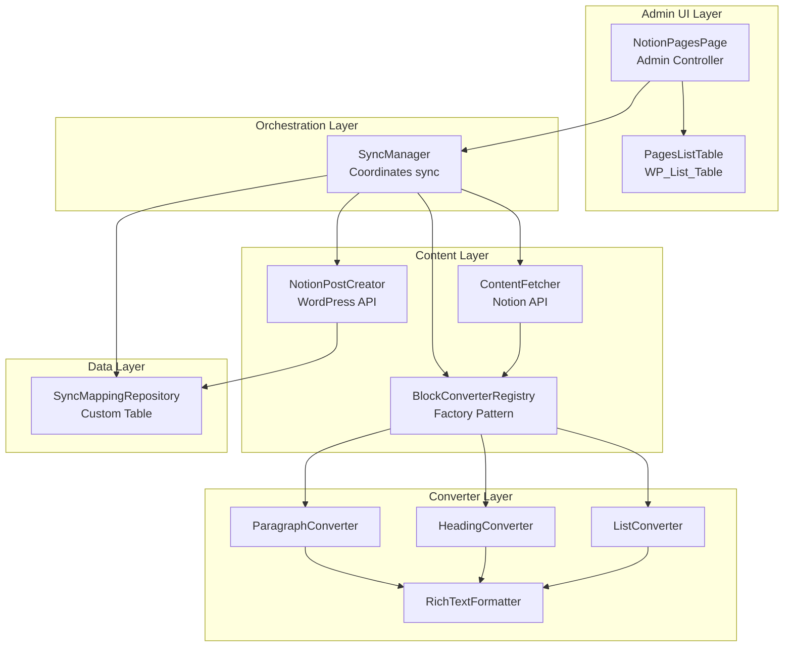

# Phase 1: MVP Core - Detailed Implementation Plan

**Version**: 1.0
**Last Updated**: 2025-10-20
**Status**: Ready to Begin

---

## Executive Summary

Phase 1 implements the core functionality of importing Notion pages to WordPress as posts with basic text formatting. This phase establishes the foundational architecture that all future phases will build upon.

**Timeline**: 10-14 days
**Complexity**: Medium (M)
**Worktree**: `/Users/patrick/Projects/thevgergroup/notion-wp-phase-1-mvp`
**Branch**: `phase-1-mvp`

---

## Success Criteria

Phase 1 is complete when:

- [ ] User can view a list of Notion pages in WordPress admin using WP_List_Table
- [ ] User can select multiple pages and bulk sync them to WordPress
- [ ] User can sync individual pages via row action
- [ ] Pages appear as WordPress posts with correct title and content
- [ ] Basic blocks work: paragraphs, headings (H1-H3), lists, bold, italic, links
- [ ] Post is editable in WordPress block editor
- [ ] Re-sync updates existing post (doesn't duplicate)
- [ ] Sync status visible in list table
- [ ] All linting passes (WPCS, PHPStan level 5)
- [ ] No PHP warnings or JavaScript console errors

---

## Phase Dependencies

**Required from Phase 0 (COMPLETE)**:
- Working Notion API authentication
- Secure token storage (Encryption class)
- Admin settings page foundation
- NotionClient class with connection test
- Development environment with linting

**Deliverables for Future Phases**:
- ContentFetcher interface for Phase 2 (database sync)
- BlockConverter registry for Phase 4 (advanced blocks)
- SyncManager interface for Phase 3 (media handling)
- Admin UI foundation for Phase 5 (field mapping)

---

## Architecture Overview

### Component Hierarchy



---

## Work Streams

### Stream 1: Content Fetcher (2-3 days)
**Priority**: CRITICAL - Foundation for all other streams
**Owner**: notion-api-specialist

#### Components
1. **ContentFetcher** (`src/Sync/ContentFetcher.php`)
   - Fetch pages accessible to integration
   - Fetch single page with properties
   - Fetch page blocks (with pagination)
   - Cache page list for performance

#### Interface Contract
```php
interface ContentFetcherInterface {
    public function listAccessiblePages(): array;
    public function fetchPage(string $page_id): array;
    public function fetchPageBlocks(string $page_id): array;
}
```

#### Acceptance Criteria
- [ ] Can fetch list of accessible Notion pages
- [ ] Returns page properties (title, last_edited_time, ID)
- [ ] Can fetch page blocks with proper pagination (100 per request)
- [ ] Handles Notion API errors gracefully
- [ ] Respects rate limits (uses existing RateLimiter if available)
- [ ] Results cached for 5 minutes (transient cache)

#### Dependencies
- NotionClient (Phase 0) ✅
- Encryption (Phase 0) ✅

---

### Stream 2: Block Converters (4-5 days)
**Priority**: HIGH - Core transformation logic
**Owner**: block-converter-specialist

#### Components
1. **BlockConverterRegistry** (`src/Converters/BlockConverterRegistry.php`)
2. **RichTextFormatter** (`src/Converters/RichTextFormatter.php`)
3. **ParagraphConverter** (`src/Converters/NotionToGutenberg/ParagraphConverter.php`)
4. **HeadingConverter** (`src/Converters/NotionToGutenberg/HeadingConverter.php`)
5. **BulletedListConverter** (`src/Converters/NotionToGutenberg/BulletedListConverter.php`)
6. **NumberedListConverter** (`src/Converters/NotionToGutenberg/NumberedListConverter.php`)

#### Interface Contract
```php
interface BlockConverterInterface {
    public function supports(): string|array;
    public function convert(array $notion_block, array $context = []): string;
    public function priority(): int;
}
```

#### Acceptance Criteria
- [ ] Registry pattern allows extensibility via WordPress filters
- [ ] RichTextFormatter handles: bold, italic, strikethrough, code, links
- [ ] ParagraphConverter outputs Gutenberg paragraph blocks
- [ ] HeadingConverter supports H1-H6 levels
- [ ] List converters handle nested lists (up to 3 levels)
- [ ] All converters sanitize output (esc_html, wp_kses_post)
- [ ] Unsupported blocks render as HTML comments with warning
- [ ] Unit tests for each converter with Notion JSON fixtures

#### Dependencies
- None (can develop in parallel with Stream 1)

---

### Stream 3: Sync Manager (3-4 days)
**Priority**: HIGH - Orchestrates everything
**Owner**: wordpress-plugin-engineer

#### Components
1. **SyncManager** (`src/Sync/SyncManager.php`)
2. **NotionPostCreator** (`src/Sync/NotionPostCreator.php`)
3. **SyncMappingRepository** (`src/Database/Repositories/SyncMappingRepository.php`)
4. **Database Schema** (`src/Database/Schema.php`)

#### Database Schema
```sql
CREATE TABLE wp_notion_sync_mappings (
    id BIGINT UNSIGNED AUTO_INCREMENT PRIMARY KEY,
    notion_page_id VARCHAR(100) NOT NULL UNIQUE,
    wp_post_id BIGINT UNSIGNED NOT NULL UNIQUE,
    notion_title VARCHAR(255),
    notion_last_edited DATETIME NOT NULL,
    wp_last_modified DATETIME NOT NULL,
    sync_status VARCHAR(20) DEFAULT 'synced',
    last_sync_attempt DATETIME,
    sync_error TEXT,
    created_at DATETIME DEFAULT CURRENT_TIMESTAMP,
    updated_at DATETIME DEFAULT CURRENT_TIMESTAMP ON UPDATE CURRENT_TIMESTAMP,
    INDEX idx_notion_page_id (notion_page_id),
    INDEX idx_wp_post_id (wp_post_id),
    INDEX idx_sync_status (sync_status),
    INDEX idx_notion_last_edited (notion_last_edited)
) ENGINE=InnoDB DEFAULT CHARSET=utf8mb4 COLLATE=utf8mb4_unicode_ci;
```

#### Interface Contract
```php
interface SyncManagerInterface {
    public function syncPage(string $notion_page_id, array $options = []): SyncResult;
    public function syncPages(array $notion_page_ids, array $options = []): BatchSyncResult;
    public function needsSync(string $notion_page_id): bool;
}
```

#### Acceptance Criteria
- [ ] Custom table created on plugin activation
- [ ] SyncManager orchestrates: fetch → convert → create/update
- [ ] NotionPostCreator creates WordPress posts via wp_insert_post
- [ ] NotionPostCreator updates existing posts via wp_update_post
- [ ] Stores mapping between Notion page ID and WP post ID
- [ ] Delta detection: compares last_edited_time, skips unchanged
- [ ] Handles errors gracefully, logs to sync_error column
- [ ] Transaction-like behavior: rollback on failure
- [ ] Returns detailed SyncResult object with success/error info

#### Dependencies
- ContentFetcher (Stream 1)
- BlockConverterRegistry (Stream 2)

---

### Stream 4: Admin UI with List Table (3-4 days)
**Priority**: MEDIUM - User-facing interface
**Owner**: wordpress-admin-ui-designer

#### Components
1. **NotionPagesPage** (`src/Admin/NotionPagesPage.php`)
2. **PagesListTable** (`src/Admin/PagesListTable.php` extends WP_List_Table)
3. **JavaScript** (`assets/js/admin-pages.js`)
4. **Styles** (`assets/css/admin-pages.css`)

#### WordPress List Table Features
- **Columns**: Checkbox | Icon | Title | Status | Last Edited | WordPress Post | Actions
- **Bulk Actions**: Sync Selected Pages, Delete Mappings
- **Row Actions**: Sync Now, View in Notion, Edit in WordPress, Delete Mapping
- **Search**: Filter by page title
- **Filters**: All | Synced | Never Synced | Needs Update | Error
- **Pagination**: 20 items per page
- **Sortable**: Title, Last Edited

#### Status Indicators
- **Never Synced**: Gray dash icon
- **Synced (Up to date)**: Green checkmark icon
- **Needs Update**: Yellow warning icon (Notion newer than WP)
- **Syncing...**: Blue spinner icon (in progress)
- **Error**: Red X icon with error message tooltip

#### Interface Layout
```
┌─────────────────────────────────────────────────────────────┐
│ Notion Pages                                   [Refresh] [?] │
├─────────────────────────────────────────────────────────────┤
│ [Bulk Actions ▼] [Apply]    All (42) | Synced (30) | Needs  │
│                              Update (10) | Error (2)         │
├───┬────┬───────────────────┬──────────┬─────────────────────┤
│☐ │ 📄 │ Title             │ Status   │ Last Edited    │ WP  │
├───┼────┼───────────────────┼──────────┼─────────────────────┤
│☐ │ 📄 │ Getting Started   │ ✓ Synced │ 2 hours ago    │Edit │
│   │    │                   │          │                │View │
│   │    │ Sync Now | View in Notion | Delete Mapping       │
├───┼────┼───────────────────┼──────────┼─────────────────────┤
│☐ │ 📄 │ Product Roadmap   │ ⚠ Update │ 1 day ago      │Edit │
│   │    │                   │          │                │View │
│   │    │ Sync Now | View in Notion | Delete Mapping       │
└───┴────┴───────────────────┴──────────┴─────────────────────┘
```

#### Acceptance Criteria
- [ ] PagesListTable extends WP_List_Table correctly
- [ ] Displays list of Notion pages fetched via ContentFetcher
- [ ] Shows sync status for each page (from SyncMappingRepository)
- [ ] Bulk action "Sync Selected" triggers SyncManager for multiple pages
- [ ] Row action "Sync Now" triggers single page sync via AJAX
- [ ] AJAX responses update status in real-time (no page reload)
- [ ] Displays error messages inline for failed syncs
- [ ] "View in Notion" link opens Notion page in new tab
- [ ] "Edit in WordPress" link opens WP post editor
- [ ] Refresh button re-fetches page list from Notion
- [ ] Help tooltip explains sync statuses
- [ ] Responsive design for mobile admin
- [ ] Follows WordPress admin design patterns
- [ ] All strings internationalized (i18n ready)

#### Dependencies
- ContentFetcher (Stream 1)
- SyncManager (Stream 3)
- SyncMappingRepository (Stream 3)

---

## Implementation Order

### Week 1: Foundation

**Days 1-2: Stream 1 (ContentFetcher)**
- Notion API specialist implements ContentFetcher
- Uses existing NotionClient from Phase 0
- Focus: Reliable page fetching with pagination

**Days 3-5: Stream 2 (Block Converters)**
- Block converter specialist implements registry and core converters
- Can work in parallel with Stream 1 completion
- Focus: Accurate Gutenberg block generation

**Days 4-6: Stream 3 (Sync Manager)**
- WordPress plugin engineer implements orchestration
- Requires Stream 1 complete, can use Stream 2 interfaces
- Focus: Robust sync logic with error handling

### Week 2: Integration & UI

**Days 7-9: Stream 4 (Admin UI)**
- Admin UI designer implements list table interface
- Requires Streams 1 & 3 complete
- Focus: WordPress-style UX with bulk actions

**Days 10-11: Integration Testing**
- All streams merge
- End-to-end testing
- Bug fixes and polish

**Days 12-14: Documentation & Release**
- User documentation
- Code documentation
- Demo video
- Tag v0.2.0-alpha

---

## Testing Strategy

### Unit Tests (Per Stream)

**Stream 1: ContentFetcher**
```php
// tests/Unit/Sync/ContentFetcherTest.php
public function test_fetch_accessible_pages_returns_array()
public function test_fetch_page_returns_properties()
public function test_fetch_page_blocks_handles_pagination()
public function test_caching_reduces_api_calls()
```

**Stream 2: Block Converters**
```php
// tests/Unit/Converters/ParagraphConverterTest.php
public function test_converts_simple_paragraph()
public function test_handles_bold_italic_formatting()
public function test_escapes_html_in_content()
public function test_converts_links_correctly()
```

**Stream 3: Sync Manager**
```php
// tests/Unit/Sync/SyncManagerTest.php
public function test_sync_page_creates_wordpress_post()
public function test_sync_page_updates_existing_post()
public function test_stores_mapping_in_database()
public function test_delta_detection_skips_unchanged()
```

**Stream 4: Admin UI**
```php
// tests/Unit/Admin/PagesListTableTest.php
public function test_list_table_displays_pages()
public function test_bulk_action_syncs_multiple_pages()
public function test_status_column_shows_correct_icon()
```

### Integration Tests

**End-to-End Sync Test**
```php
// tests/Integration/FullSyncWorkflowTest.php
public function test_complete_sync_workflow()
{
    // 1. Fetch Notion pages
    $pages = $this->contentFetcher->listAccessiblePages();
    $this->assertNotEmpty($pages);

    // 2. Sync first page
    $result = $this->syncManager->syncPage($pages[0]['id']);
    $this->assertTrue($result->success);

    // 3. Verify WordPress post created
    $post = get_post($result->wp_post_id);
    $this->assertNotNull($post);
    $this->assertEquals($pages[0]['title'], $post->post_title);

    // 4. Verify mapping stored
    $mapping = $this->repository->findByNotionId($pages[0]['id']);
    $this->assertEquals($result->wp_post_id, $mapping->wp_post_id);

    // 5. Re-sync (should update, not duplicate)
    $result2 = $this->syncManager->syncPage($pages[0]['id']);
    $this->assertEquals($result->wp_post_id, $result2->wp_post_id);

    // 6. Verify no duplicate posts created
    $posts = get_posts(['post_type' => 'post', 'numberposts' => -1]);
    $this->assertCount(1, $posts);
}
```

### Manual Testing Checklist

**Sync Functionality**
- [ ] Sync single Notion page with text content
- [ ] Verify page created in WordPress with correct title
- [ ] Verify paragraphs, headings, lists render correctly
- [ ] Verify bold, italic, links preserved
- [ ] Re-sync same page, verify it updates (no duplicate)
- [ ] Sync page with empty content (edge case)
- [ ] Sync page with very long content (10,000+ words)
- [ ] Sync page with special characters in title (UTF-8, emojis)

**Admin UI**
- [ ] List table displays Notion pages
- [ ] Status icons show correctly for each page
- [ ] Bulk sync selected pages works
- [ ] Individual "Sync Now" action works
- [ ] AJAX updates status without page reload
- [ ] Error messages display inline
- [ ] "View in Notion" link opens correct page
- [ ] "Edit in WordPress" link opens post editor
- [ ] Search filter finds pages by title
- [ ] Status filter shows correct subsets
- [ ] Pagination works for 100+ pages
- [ ] Mobile responsive design

**Error Handling**
- [ ] Invalid Notion page ID shows error
- [ ] Network error during sync shows helpful message
- [ ] WordPress post creation failure rolls back
- [ ] Notion API rate limit handled gracefully

---

## File Structure

```
plugin/
├── src/
│   ├── Admin/
│   │   ├── NotionPagesPage.php       [Stream 4] Admin controller
│   │   └── PagesListTable.php        [Stream 4] WP_List_Table implementation
│   ├── Sync/
│   │   ├── ContentFetcher.php        [Stream 1] Notion API integration
│   │   ├── SyncManager.php           [Stream 3] Orchestration
│   │   ├── NotionPostCreator.php     [Stream 3] WordPress post creation
│   │   └── SyncResult.php            [Stream 3] Result value object
│   ├── Converters/
│   │   ├── BlockConverterInterface.php         [Stream 2]
│   │   ├── BlockConverterRegistry.php          [Stream 2]
│   │   ├── RichTextFormatter.php               [Stream 2]
│   │   └── NotionToGutenberg/
│   │       ├── ParagraphConverter.php          [Stream 2]
│   │       ├── HeadingConverter.php            [Stream 2]
│   │       ├── BulletedListConverter.php       [Stream 2]
│   │       └── NumberedListConverter.php       [Stream 2]
│   └── Database/
│       ├── Schema.php                          [Stream 3]
│       └── Repositories/
│           └── SyncMappingRepository.php       [Stream 3]
├── assets/
│   ├── js/
│   │   └── admin-pages.js            [Stream 4] AJAX sync handling
│   └── css/
│       └── admin-pages.css           [Stream 4] List table styles
├── templates/
│   └── admin/
│       └── pages-list.php            [Stream 4] Admin page template
└── tests/
    ├── Unit/
    │   ├── Sync/
    │   ├── Converters/
    │   └── Admin/
    └── Integration/
        └── FullSyncWorkflowTest.php
```

---

## Agent Coordination

### Communication Channels

**Inter-Agent Communication**:
- Each agent documents their interfaces in code comments
- Shared document: `docs/agent-coordination.md` (track blockers, interface changes)
- Weekly sync: Review progress, discuss integration points

**Interface Handoffs**:

1. **Stream 1 → Stream 3**: ContentFetcher interface
   - Stream 1 completes: Day 2
   - Stream 3 can integrate: Day 3
   - Contract: `ContentFetcherInterface` methods

2. **Stream 2 → Stream 3**: BlockConverterRegistry
   - Stream 2 completes: Day 5
   - Stream 3 can integrate: Day 6
   - Contract: `BlockConverterInterface` and registry methods

3. **Stream 3 → Stream 4**: SyncManager + Repository
   - Stream 3 completes: Day 6
   - Stream 4 can integrate: Day 7
   - Contract: `SyncManagerInterface` and database schema

### Blocker Resolution

**If Stream 1 delayed**:
- Stream 2 continues independently (no dependencies)
- Stream 3 uses mock ContentFetcher until real one ready
- Stream 4 waits or uses static mock data

**If Stream 2 delayed**:
- Stream 3 uses fallback converter (raw HTML output)
- Can still demonstrate end-to-end sync with plain text
- Stream 4 continues (doesn't depend on converters)

**If Stream 3 delayed**:
- Stream 4 uses mock SyncManager for UI development
- Can build and test admin interface independently
- Integration happens when Stream 3 ready

---

## Performance Targets

### API Efficiency
- **Page list fetch**: < 2 seconds for 100 pages
- **Single page sync**: < 3 seconds (fetch + convert + save)
- **Bulk sync (10 pages)**: < 30 seconds
- **Cache hit rate**: > 80% for repeated page list fetches

### Memory Usage
- **Single page sync**: < 50 MB peak memory
- **Bulk sync (10 pages)**: < 100 MB peak memory

### Database Performance
- **Mapping lookup**: < 10ms (indexed query)
- **Mapping insert**: < 20ms
- **List table query**: < 100ms for 1000 mappings

---

## Known Limitations (Phase 1 Scope)

**Out of Scope for Phase 1** (deferred to later phases):

1. **Advanced Block Types**
   - Images, files, embeds → Phase 3
   - Code blocks, tables, toggles → Phase 4
   - Columns, callouts, bookmarks → Phase 4

2. **Database Sync**
   - Syncing Notion databases → Phase 2
   - Property field mapping → Phase 2
   - Batch operations → Phase 2

3. **Hierarchy & Navigation**
   - Child pages → Phase 5
   - Page relationships → Phase 5
   - Menu generation → Phase 5
   - Internal link conversion → Phase 5

4. **Real-Time Sync**
   - Webhooks → Phase 6+
   - Scheduled polling → Phase 6+
   - Background queue → Phase 2 (if needed for bulk)

5. **Bi-Directional Sync**
   - WordPress → Notion → Post-MVP (Phase 7+)

**Fallback Behavior in Phase 1**:
- Unsupported blocks render as HTML comments: `<!-- Unsupported block: code -->`
- User sees warning in admin but sync doesn't fail
- Can manually edit WordPress post to add missing content

---

## Risk Mitigation

| Risk | Likelihood | Impact | Mitigation |
|------|-----------|--------|------------|
| Notion API pagination complexity | Medium | High | Test with workspace containing 500+ pages early |
| Block conversion accuracy issues | Medium | Medium | Extensive unit tests with real Notion JSON fixtures |
| WP_List_Table learning curve | Low | Medium | Reference WP core examples (Posts list table) |
| Agent coordination delays | Medium | Low | Clear interface contracts, daily progress updates |
| Performance issues with large pages | Low | Medium | Test with 10,000-word Notion pages, optimize if needed |

---

## Definition of Done

Phase 1 is complete and ready to merge when:

### Functional Requirements
- [ ] All success criteria met (see top of document)
- [ ] All acceptance criteria met for each stream
- [ ] Manual testing checklist 100% complete
- [ ] No critical bugs in issue tracker

### Code Quality
- [ ] All unit tests pass (80%+ coverage per stream)
- [ ] Integration test passes (full sync workflow)
- [ ] PHPCS passes with WordPress standards
- [ ] PHPStan level 5 passes with zero errors
- [ ] No PHP warnings or notices
- [ ] No JavaScript console errors

### Documentation
- [ ] All classes have DocBlock comments
- [ ] README.md updated with Phase 1 features
- [ ] User guide written (how to sync pages)
- [ ] Developer docs updated (architecture, interfaces)
- [ ] Inline code comments for complex logic

### Integration
- [ ] All four streams merged to phase-1-mvp branch
- [ ] No merge conflicts
- [ ] Code reviewed by at least one other agent
- [ ] Demo video recorded (2-minute walkthrough)

### Performance
- [ ] Performance targets met (see Performance Targets section)
- [ ] No N+1 queries (Query Monitor check)
- [ ] Caching works correctly (transients set and retrieved)

---

## Next Steps After Phase 1

Once Phase 1 is complete and tagged as `v0.2.0-alpha`:

1. **User Feedback Session**: Demo to 3-5 beta users, collect feedback
2. **Phase 2 Planning**: Database sync and field mapping
3. **Performance Optimization**: If targets not met, dedicate 1-2 days to optimization
4. **WordPress.org Preparation**: Begin preparing plugin for directory submission

---

## Appendix A: Agent Assignments

### notion-api-specialist
**Responsibility**: Stream 1 (ContentFetcher)
**Timeline**: Days 1-2
**Files**: `src/Sync/ContentFetcher.php`, related tests
**Blockers**: None (uses existing NotionClient)

### block-converter-specialist
**Responsibility**: Stream 2 (Block Converters)
**Timeline**: Days 3-5
**Files**: All files in `src/Converters/`, related tests
**Blockers**: None (independent work)

### wordpress-plugin-engineer
**Responsibility**: Stream 3 (Sync Manager)
**Timeline**: Days 4-6
**Files**: `src/Sync/SyncManager.php`, `src/Database/`, related tests
**Blockers**: Needs ContentFetcher interface (Day 2), BlockConverter interface (Day 3)

### wordpress-admin-ui-designer
**Responsibility**: Stream 4 (Admin UI)
**Timeline**: Days 7-9
**Files**: `src/Admin/`, `assets/`, `templates/admin/`, related tests
**Blockers**: Needs SyncManager complete (Day 6)

### wordpress-project-manager (You)
**Responsibility**: Coordination, integration, testing
**Timeline**: Throughout phase, intensive Days 10-14
**Tasks**: Daily standups, blocker resolution, integration testing, documentation review

---

## Appendix B: Example Notion JSON Fixtures

**Paragraph Block**:
```json
{
  "object": "block",
  "id": "abc-123",
  "type": "paragraph",
  "paragraph": {
    "rich_text": [
      {
        "type": "text",
        "text": { "content": "This is " },
        "annotations": {
          "bold": false,
          "italic": false,
          "strikethrough": false,
          "underline": false,
          "code": false,
          "color": "default"
        }
      },
      {
        "type": "text",
        "text": { "content": "bold text" },
        "annotations": { "bold": true, "italic": false }
      }
    ]
  }
}
```

**Heading Block**:
```json
{
  "object": "block",
  "id": "def-456",
  "type": "heading_2",
  "heading_2": {
    "rich_text": [
      {
        "type": "text",
        "text": { "content": "Section Title" },
        "annotations": { "bold": false, "italic": false }
      }
    ]
  }
}
```

**List Block**:
```json
{
  "object": "block",
  "id": "ghi-789",
  "type": "bulleted_list_item",
  "bulleted_list_item": {
    "rich_text": [
      {
        "type": "text",
        "text": { "content": "List item with " }
      },
      {
        "type": "text",
        "text": { "content": "link", "link": { "url": "https://example.com" } }
      }
    ]
  }
}
```

---

**End of Phase 1 Implementation Plan**

**Ready to begin**: Yes ✅
**Blockers**: None
**Next Action**: Launch specialized agents for each work stream
