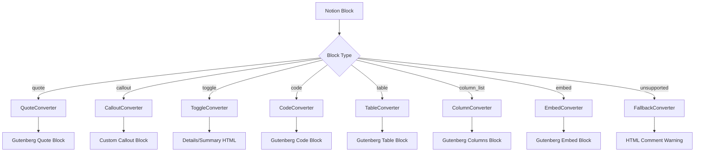

# Phase 4: Advanced Blocks - Implementation Plan

## Overview

**Goal:** Support complex Notion block types (callouts, toggles, quotes, code, tables, embeds).

**Status:** 🚧 In Progress
**Estimated Duration:** 2 weeks
**Complexity:** L (Large)

## Success Criteria

- [ ] Quote blocks → WordPress quote blocks
- [ ] Callout blocks → Custom styled blocks
- [ ] Toggle blocks → Expandable sections
- [ ] Code blocks → Syntax highlighted code
- [ ] Tables → WordPress table blocks
- [ ] Column layouts preserved
- [ ] Embed blocks (YouTube, Twitter) work
- [ ] Graceful fallback for unsupported blocks

## Dependencies

**Required from Phase 1:**
- ✅ Block converter infrastructure (BlockConverter class)
- ✅ Extensibility hooks for custom converters
- ✅ Base converter test framework

**Required from Phase 3:**
- ✅ Media handling for embedded images in callouts/tables

## Architecture Overview



## Implementation Streams

### Stream 1: Quote & Callout Blocks (Week 1, Days 1-3)

**Priority:** HIGH - Most commonly used blocks

#### 1.1 Quote Block Converter

**File:** `plugin/src/Blocks/Converters/QuoteConverter.php`

```php
class QuoteConverter implements ConverterInterface {
    public function supports(array $block): bool;
    public function convert(array $block): string;
    private function extract_quote_text(array $rich_text): string;
    private function get_citation(array $block): ?string;
}
```

**Notion Block Structure:**
```json
{
    "type": "quote",
    "quote": {
        "rich_text": [...],
        "color": "default"
    }
}
```

**WordPress Output:**
```html
<!-- wp:quote -->
<blockquote class="wp-block-quote">
    <p>Quote text here</p>
</blockquote>
<!-- /wp:quote -->
```

**Tests:**
- ✅ Simple quote conversion
- ✅ Quote with formatting (bold, italic, links)
- ✅ Quote with color (map to CSS class)
- ✅ Empty quote handling
- ✅ Multi-paragraph quote

#### 1.2 Callout Block Converter

**File:** `plugin/src/Blocks/Converters/CalloutConverter.php`

**Challenge:** Notion callouts have icons and colors that don't map to standard Gutenberg blocks.

**Solution:** Create custom HTML block with styling.

```php
class CalloutConverter implements ConverterInterface {
    public function supports(array $block): bool;
    public function convert(array $block): string;
    private function get_callout_icon(array $block): string;
    private function get_callout_color(string $color): string;
    private function render_callout_html(string $icon, string $color, string $content): string;
}
```

**Notion Block Structure:**
```json
{
    "type": "callout",
    "callout": {
        "rich_text": [...],
        "icon": {
            "type": "emoji",
            "emoji": "💡"
        },
        "color": "gray_background"
    }
}
```

**WordPress Output:**
```html
<!-- wp:html -->
<div class="notion-callout notion-callout--gray">
    <div class="notion-callout__icon">💡</div>
    <div class="notion-callout__content">
        <p>Callout text here</p>
    </div>
</div>
<!-- /wp:html -->
```

**CSS Required:** `plugin/assets/css/callout-blocks.css`

**Tests:**
- ✅ Callout with emoji icon
- ✅ Callout with different colors (gray, blue, yellow, red)
- ✅ Callout with formatted text
- ✅ Callout without icon
- ✅ Nested content in callouts

**Deliverables:**
- `QuoteConverter.php`
- `CalloutConverter.php`
- `tests/unit/Blocks/Converters/QuoteConverterTest.php`
- `tests/unit/Blocks/Converters/CalloutConverterTest.php`
- `plugin/assets/css/callout-blocks.css`

---

### Stream 2: Code & Toggle Blocks (Week 1, Days 4-7)

**Priority:** HIGH - Common in technical documentation

#### 2.1 Code Block Converter

**File:** `plugin/src/Blocks/Converters/CodeConverter.php`

```php
class CodeConverter implements ConverterInterface {
    public function supports(array $block): bool;
    public function convert(array $block): string;
    private function get_language(array $block): string;
    private function escape_code_content(string $code): string;
}
```

**Notion Block Structure:**
```json
{
    "type": "code",
    "code": {
        "rich_text": [{
            "type": "text",
            "text": { "content": "function example() {...}" }
        }],
        "language": "javascript",
        "caption": []
    }
}
```

**WordPress Output:**
```html
<!-- wp:code -->
<pre class="wp-block-code"><code lang="javascript">function example() {...}</code></pre>
<!-- /wp:code -->
```

**Language Mapping:**
- Notion `plain text` → WordPress `plaintext`
- Notion `javascript` → WordPress `javascript`
- Notion `python` → WordPress `python`
- etc.

**Tests:**
- ✅ Code block with language
- ✅ Code block without language (plain text)
- ✅ Code with special characters (escaping)
- ✅ Multi-line code
- ✅ Code with caption

#### 2.2 Toggle Block Converter

**File:** `plugin/src/Blocks/Converters/ToggleConverter.php`

**Challenge:** WordPress doesn't have native toggle/accordion blocks.

**Solution:** Use HTML `<details>` and `<summary>` elements.

```php
class ToggleConverter implements ConverterInterface {
    public function supports(array $block): bool;
    public function convert(array $block): string;
    private function get_summary(array $rich_text): string;
    private function convert_children(array $children): string;
}
```

**Notion Block Structure:**
```json
{
    "type": "toggle",
    "toggle": {
        "rich_text": [{ "text": { "content": "Click to expand" } }],
        "children": [...]
    },
    "has_children": true
}
```

**WordPress Output:**
```html
<!-- wp:html -->
<details class="notion-toggle">
    <summary>Click to expand</summary>
    <div class="notion-toggle__content">
        <!-- Converted children blocks -->
    </div>
</details>
<!-- /wp:html -->
```

**Note:** Must fetch children blocks separately via Notion API.

**Tests:**
- ✅ Toggle with simple text
- ✅ Toggle with nested paragraphs
- ✅ Toggle with nested lists
- ✅ Multiple toggles in sequence
- ✅ Empty toggle

**Deliverables:**
- `CodeConverter.php`
- `ToggleConverter.php`
- `tests/unit/Blocks/Converters/CodeConverterTest.php`
- `tests/unit/Blocks/Converters/ToggleConverterTest.php`
- `plugin/assets/css/toggle-blocks.css`

---

### Stream 3: Tables & Columns (Week 2, Days 1-5)

**Priority:** MEDIUM - Complex but important for content structure

#### 3.1 Table Block Converter

**File:** `plugin/src/Blocks/Converters/TableConverter.php`

```php
class TableConverter implements ConverterInterface {
    public function supports(array $block): bool;
    public function convert(array $block): string;
    private function fetch_table_rows(string $block_id): array;
    private function convert_table_to_html(array $rows, bool $has_column_header, bool $has_row_header): string;
    private function convert_cell_content(array $cell): string;
}
```

**Notion Block Structure:**
```json
{
    "type": "table",
    "table": {
        "table_width": 3,
        "has_column_header": true,
        "has_row_header": false
    },
    "has_children": true
}
```

**Table Rows (fetched separately):**
```json
{
    "type": "table_row",
    "table_row": {
        "cells": [
            [{ "text": { "content": "Header 1" } }],
            [{ "text": { "content": "Header 2" } }],
            [{ "text": { "content": "Header 3" } }]
        ]
    }
}
```

**WordPress Output:**
```html
<!-- wp:table -->
<figure class="wp-block-table">
    <table>
        <thead>
            <tr>
                <th>Header 1</th>
                <th>Header 2</th>
                <th>Header 3</th>
            </tr>
        </thead>
        <tbody>
            <tr>
                <td>Cell 1</td>
                <td>Cell 2</td>
                <td>Cell 3</td>
            </tr>
        </tbody>
    </table>
</figure>
<!-- /wp:table -->
```

**Tests:**
- ✅ Table with column headers
- ✅ Table with row headers
- ✅ Table with both headers
- ✅ Table without headers
- ✅ Table with formatted cell content
- ✅ Large table (10x10)

#### 3.2 Column Block Converter

**File:** `plugin/src/Blocks/Converters/ColumnConverter.php`

**Challenge:** Notion's column_list → column structure is complex.

```php
class ColumnConverter implements ConverterInterface {
    public function supports(array $block): bool;
    public function convert(array $block): string;
    private function fetch_columns(string $block_id): array;
    private function convert_column_list_to_gutenberg(array $columns): string;
}
```

**Notion Block Structure:**
```json
{
    "type": "column_list",
    "has_children": true
}
// Children:
{
    "type": "column",
    "has_children": true
}
```

**WordPress Output:**
```html
<!-- wp:columns -->
<div class="wp-block-columns">
    <!-- wp:column -->
    <div class="wp-block-column">
        <!-- Column content -->
    </div>
    <!-- /wp:column -->

    <!-- wp:column -->
    <div class="wp-block-column">
        <!-- Column content -->
    </div>
    <!-- /wp:column -->
</div>
<!-- /wp:columns -->
```

**Tests:**
- ✅ Two-column layout
- ✅ Three-column layout
- ✅ Uneven column widths
- ✅ Nested content in columns
- ✅ Empty columns

**Deliverables:**
- `TableConverter.php`
- `ColumnConverter.php`
- `tests/unit/Blocks/Converters/TableConverterTest.php`
- `tests/unit/Blocks/Converters/ColumnConverterTest.php`

---

### Stream 4: Embeds & Fallbacks (Week 2, Days 6-7)

**Priority:** MEDIUM - Nice to have, edge case handling

#### 4.1 Embed Block Converter

**File:** `plugin/src/Blocks/Converters/EmbedConverter.php`

```php
class EmbedConverter implements ConverterInterface {
    public function supports(array $block): bool;
    public function convert(array $block): string;
    private function get_embed_type(array $block): string;
    private function get_embed_url(array $block): string;
    private function convert_to_gutenberg_embed(string $type, string $url): string;
}
```

**Supported Embed Types:**
- `video` (YouTube, Vimeo)
- `bookmark` (Generic URL preview)
- `pdf` (Embedded PDF)
- `tweet` (Twitter/X)

**Notion Block Structure:**
```json
{
    "type": "video",
    "video": {
        "type": "external",
        "external": {
            "url": "https://www.youtube.com/watch?v=..."
        }
    }
}
```

**WordPress Output:**
```html
<!-- wp:embed {"url":"https://www.youtube.com/watch?v=...","type":"video","providerNameSlug":"youtube"} -->
<figure class="wp-block-embed is-type-video is-provider-youtube">
    <div class="wp-block-embed__wrapper">
        https://www.youtube.com/watch?v=...
    </div>
</figure>
<!-- /wp:embed -->
```

**Tests:**
- ✅ YouTube embed
- ✅ Vimeo embed
- ✅ Twitter/X embed
- ✅ Generic bookmark
- ✅ Unsupported embed fallback

#### 4.2 Fallback Converter

**File:** `plugin/src/Blocks/Converters/FallbackConverter.php`

**Purpose:** Handle any unsupported Notion block types gracefully.

```php
class FallbackConverter implements ConverterInterface {
    public function supports(array $block): bool {
        return true; // Catches everything
    }

    public function convert(array $block): string;
    private function create_warning_comment(string $block_type, string $block_id): string;
}
```

**WordPress Output:**
```html
<!-- wp:html -->
<!-- NOTION BLOCK NOT SUPPORTED: type="synced_block" id="abc-123" -->
<!-- Original content may be lost. Please review this section manually. -->
<!-- /wp:html -->
```

**Tests:**
- ✅ Unknown block type warning
- ✅ Synced block warning
- ✅ Template block warning

**Deliverables:**
- `EmbedConverter.php`
- `FallbackConverter.php`
- `tests/unit/Blocks/Converters/EmbedConverterTest.php`
- `tests/unit/Blocks/Converters/FallbackConverterTest.php`

---

## Technical Implementation Details

### Converter Registration

Update `BlockConverter` to register new converters:

```php
// In BlockConverter::__construct()
$this->converters = [
    // Existing converters
    new ParagraphConverter(),
    new HeadingConverter(),
    new BulletedListConverter(),
    new NumberedListConverter(),
    new ImageConverter(),
    new FileConverter(),

    // Phase 4 converters
    new QuoteConverter(),
    new CalloutConverter(),
    new CodeConverter(),
    new ToggleConverter(),
    new TableConverter(),
    new ColumnConverter(),
    new EmbedConverter(),

    // Must be last - catches all unsupported types
    new FallbackConverter(),
];
```

### CSS Styling

**File:** `plugin/assets/css/advanced-blocks.css`

```css
/* Callout Blocks */
.notion-callout {
    display: flex;
    padding: 16px;
    margin: 16px 0;
    border-radius: 4px;
}

.notion-callout--gray { background: #f1f1f0; }
.notion-callout--blue { background: #e7f3ff; }
.notion-callout--yellow { background: #fef3c7; }
.notion-callout--red { background: #ffe0e0; }

.notion-callout__icon {
    margin-right: 12px;
    font-size: 24px;
}

/* Toggle Blocks */
.notion-toggle {
    margin: 8px 0;
    border: 1px solid #e0e0e0;
    border-radius: 4px;
}

.notion-toggle summary {
    cursor: pointer;
    padding: 8px 12px;
    font-weight: 500;
}

.notion-toggle__content {
    padding: 8px 12px;
    border-top: 1px solid #e0e0e0;
}
```

### Asset Enqueuing

Update main plugin file to enqueue CSS:

```php
// In notion-sync.php or assets handler
add_action('wp_enqueue_scripts', function() {
    wp_enqueue_style(
        'notion-sync-blocks',
        NOTION_SYNC_URL . 'assets/css/advanced-blocks.css',
        [],
        NOTION_WP_VERSION
    );
});
```

---

## Testing Strategy

### Unit Tests

**Coverage Goal:** 80%+ for all new converters

Each converter must have tests for:
1. `supports()` method - correct block type detection
2. `convert()` method - basic conversion
3. Edge cases (empty content, malformed data)
4. Formatting preservation
5. Nested content handling (where applicable)

### Integration Tests

**File:** `tests/integration/Blocks/AdvancedBlocksIntegrationTest.php`

Test scenarios:
- [ ] Quote block in real WordPress post
- [ ] Callout block renders with CSS
- [ ] Code block with syntax highlighting
- [ ] Toggle block expands/collapses (frontend JS)
- [ ] Table with complex content
- [ ] Column layout responsive design
- [ ] Embed block loads external content

### Manual Testing Checklist

- [ ] Create Notion page with all advanced block types
- [ ] Sync to WordPress
- [ ] Verify each block renders correctly
- [ ] Check mobile/responsive layout
- [ ] Test in Classic Editor (should show as HTML)
- [ ] Test in Gutenberg Editor (should be editable)
- [ ] Verify re-sync updates content correctly

---

## Known Limitations & Future Work

### Phase 4 Limitations

1. **Synced Blocks:** Not supported - shows warning comment
2. **Template Blocks:** Not supported - shows warning comment
3. **Database Views:** Not supported (handled in Phase 2)
4. **Math Equations:** Not supported - shows as plain text
5. **Nested Toggles:** Limited depth (max 3 levels to prevent performance issues)
6. **Column Width:** Equal widths only (Notion allows custom ratios)

### Post-Phase 4 Enhancements (v1.3+)

- Custom Gutenberg blocks for callouts (instead of HTML)
- Syntax highlighting for code blocks (integrate Prism.js)
- Math equation rendering (KaTeX integration)
- Synced block support (requires complex state management)
- Custom column width ratios
- Table cell merging support

---

## Definition of Done

### Code Quality
- [ ] All 8 converters implemented
- [ ] PHPCS passes (WordPress Coding Standards)
- [ ] PHPStan passes (level 5)
- [ ] 80%+ unit test coverage

### Functionality
- [ ] All success criteria met
- [ ] Manual testing checklist complete
- [ ] No console errors
- [ ] No PHP warnings

### Documentation
- [ ] Inline code documentation
- [ ] User-facing documentation updated
- [ ] Known limitations documented
- [ ] Examples in docs

### Release Readiness
- [ ] CSS properly enqueued
- [ ] Assets minified for production
- [ ] Tested on WordPress 6.0+
- [ ] Tested on PHP 8.0+
- [ ] Can demo all block types in < 10 minutes

---

## Timeline

### Week 1
- **Day 1-2:** Quote & Callout converters + tests
- **Day 3:** CSS styling for callouts
- **Day 4-5:** Code & Toggle converters + tests
- **Day 6-7:** Toggle CSS, integration testing

### Week 2
- **Day 1-3:** Table converter + tests
- **Day 4:** Column converter + tests
- **Day 5-6:** Embed & Fallback converters
- **Day 7:** Final testing, documentation, PR review

---

## Success Metrics

- **Block Coverage:** 95%+ of common Notion blocks supported
- **Test Coverage:** 80%+ code coverage
- **Performance:** Sync 100-block page in < 30 seconds
- **Quality:** Zero PHP warnings, zero console errors
- **User Satisfaction:** Can sync complex Notion pages without manual cleanup

---

## Next Steps

1. ✅ Create phase-4-advanced-blocks worktree
2. ✅ Document implementation plan
3. 🔲 Start with QuoteConverter implementation
4. 🔲 Write QuoteConverterTest
5. 🔲 Continue with CalloutConverter
6. 🔲 Proceed through implementation streams sequentially

---

## Notes

- Prioritize quote and callout blocks first - most commonly used
- Tables are complex - allocate extra time for edge cases
- Fallback converter must be last in converter chain
- Consider performance impact of fetching nested children (toggles, tables, columns)
- CSS must work with common WordPress themes (test with Twenty Twenty-Four)
