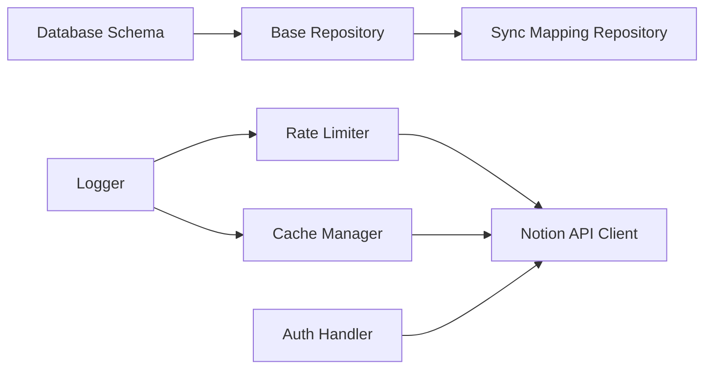
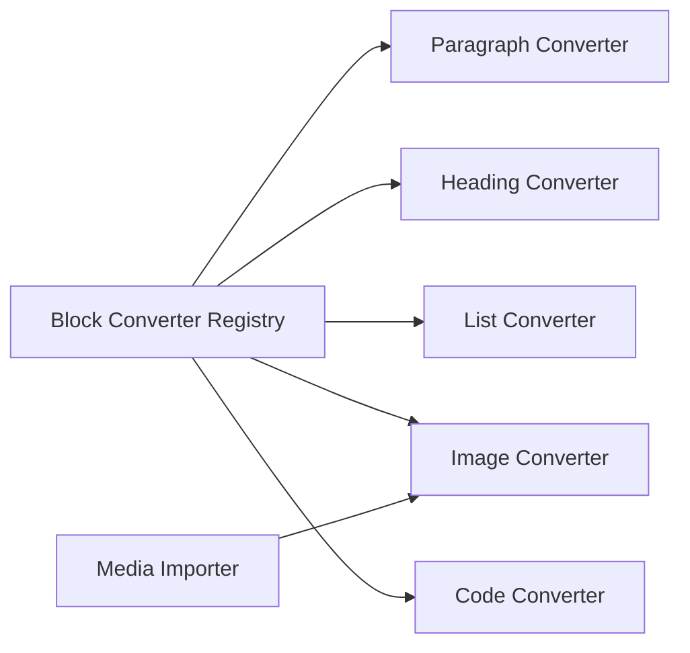
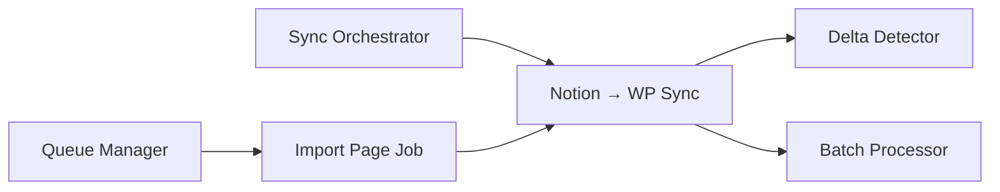
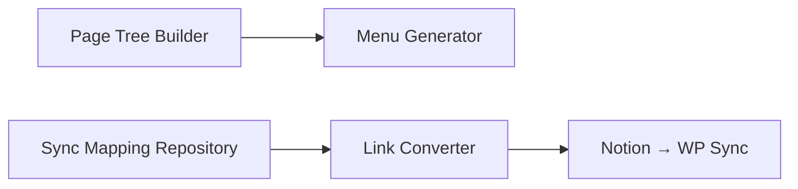
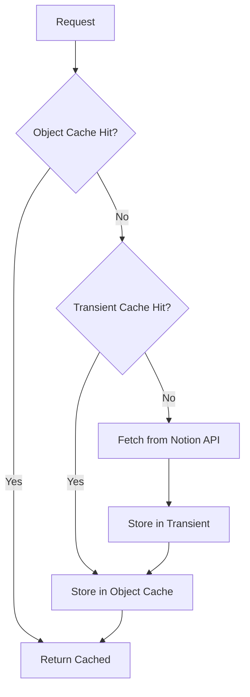
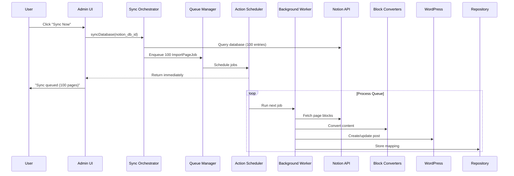

# Technical Architecture: Notion-WordPress Sync Plugin

**Document Version**: 1.0
**Last Updated**: 2025-10-19
**Author**: Claude Code (WordPress Plugin Architect)

---

## Table of Contents

1. [Executive Summary](#executive-summary)
2. [Component Architecture](#component-architecture)
3. [Dependency Analysis](#dependency-analysis)
4. [Critical Path Components](#critical-path-components)
5. [Parallel Work Stream Strategy](#parallel-work-stream-strategy)
6. [Interface Contracts](#interface-contracts)
7. [Performance Architecture](#performance-architecture)
8. [Testing Strategy](#testing-strategy)
9. [Implementation Roadmap](#implementation-roadmap)

---

## Executive Summary

This document defines the technical architecture for a bi-directional Notion-WordPress synchronization plugin. The architecture prioritizes:

- **Scalability**: Handling 1000+ Notion pages with efficient pagination and background processing
- **Extensibility**: Plugin architecture allowing custom block converters and field mappings
- **Performance**: Strategic caching, database optimization, and rate limit management
- **Maintainability**: Clean separation of concerns, PSR-4 autoloading, dependency injection

**Key Architectural Decisions**:
- Custom database tables for mapping storage (post meta doesn't scale)
- Action Scheduler for reliable background processing
- Repository pattern for data access layer
- Registry pattern for extensible block converters
- Service-oriented architecture with dependency injection

---

## Component Architecture

### Component Diagram

```mermaid
graph TB
    subgraph "WordPress Admin"
        A[Admin Controller]
        A --> B[Settings Page]
        A --> C[Sync Dashboard]
        A --> D[Field Mapper UI]
    end

    subgraph "Core Sync Engine"
        E[Sync Orchestrator]
        E --> F[Notion → WP Sync]
        E --> G[WP → Notion Sync]
        E --> H[Conflict Resolver]
        E --> I[Delta Detector]
    end

    subgraph "External Integration"
        J[Notion API Client]
        J --> K[Authentication Handler]
        J --> L[Rate Limiter]
        J --> M[Request Logger]
    end

    subgraph "Content Processing"
        N[Block Converter Registry]
        N --> O[Notion → Gutenberg Converters]
        N --> P[Gutenberg → Notion Converters]
        N --> Q[Fallback Converter]
    end

    subgraph "Media Management"
        R[Media Importer]
        R --> S[Image Downloader]
        R --> T[File Uploader]
        R --> U[Media Cache]
        R --> V[Duplication Checker]
    end

    subgraph "Navigation & Hierarchy"
        W[Menu Generator]
        W --> X[Hierarchy Mapper]
        W --> Y[Link Converter]
        W --> Z[Page Tree Builder]
    end

    subgraph "Data Persistence"
        AA[Sync Mapping Repository]
        AB[Sync Log Repository]
        AC[Field Map Repository]
        AA --> AD[(Custom Tables)]
        AB --> AD
        AC --> AD
    end

    subgraph "Background Processing"
        AE[Queue Manager]
        AE --> AF[Action Scheduler Adapter]
        AF --> AG[Import Page Job]
        AF --> AH[Import Image Job]
        AF --> AI[Sync Database Job]
        AF --> AJ[Poll Notion Job]
    end

    subgraph "REST API"
        AK[Webhook Controller]
        AL[Sync Controller]
        AM[Status Controller]
    end

    subgraph "Caching Layer"
        AN[Cache Manager]
        AN --> AO[Object Cache]
        AN --> AP[Transient Cache]
        AN --> AQ[Cache Warmer]
    end

    A -->|Triggers| E
    E -->|Uses| J
    E -->|Queues Jobs| AE
    F -->|Converts| N
    F -->|Imports Media| R
    F -->|Updates Navigation| W
    F -->|Stores Mappings| AA
    J -->|Cached Responses| AN
    W -->|Queries Mappings| AA
    Y -->|Queries Mappings| AA
    AK -->|Triggers| E
    AL -->|Triggers| E
```



### Component Dependency Matrix

| Component | Depends On | Depended On By |
|-----------|-----------|----------------|
| **Notion API Client** | Rate Limiter, Auth Handler | Sync Orchestrator, Webhook Controller |
| **Sync Orchestrator** | Notion API Client, Queue Manager, Repositories | Admin Controller, REST Controllers |
| **Block Converter Registry** | Individual Converters | Sync Engines (N→WP, WP→N) |
| **Media Importer** | Notion API Client, Media Cache Repository | Block Converters (Image, File) |
| **Navigation Generator** | Sync Mapping Repository, Page Tree Builder | Sync Orchestrator |
| **Queue Manager** | Action Scheduler | Sync Orchestrator, Webhook Controller |
| **Repositories** | wpdb, Database Schema | All components needing persistence |
| **Cache Manager** | WordPress Object Cache API | Notion API Client, Repositories |
| **Admin UI** | All components (reads state) | None (top-level) |
| **REST API Controllers** | Sync Orchestrator | External webhooks, AJAX calls |

---

## Dependency Analysis

### Foundation Layer (No Dependencies)

These components have zero or minimal internal dependencies and can be developed independently:

1. **Database Schema** (`Database/Schema/DatabaseSchema.php`)
   - Creates custom tables on plugin activation
   - Zero dependencies beyond wpdb
   - **Why First**: All repositories depend on table structure

2. **Rate Limiter** (`API/RateLimiter.php`)
   - Enforces 50 req/sec Notion API limit
   - Uses WordPress Transients API
   - **Why Early**: Prevents API throttling during development

3. **Logger** (`Utilities/Logger.php`)
   - Wraps error_log or WP debug.log
   - No internal dependencies
   - **Why Early**: Needed for debugging all other components

4. **Sanitizer/Validator** (`Utilities/`)
   - Input sanitization and validation
   - WordPress sanitization function wrappers
   - **Why Early**: Used across admin UI and API handling

### Core Infrastructure Layer (Foundation Dependency)

Components that depend only on foundation layer:

5. **Repository Base Classes** (`Database/Repositories/`)
   - Abstract repository pattern implementation
   - Depends: Database Schema
   - **Why Second**: Data access layer for everything else

6. **Cache Manager** (`Caching/CacheInterface.php`, `Caching/ObjectCache.php`)
   - WordPress object cache wrapper
   - Depends: Logger
   - **Why Second**: Used by API client and repositories

7. **Container** (`Container.php`)
   - Dependency injection container
   - Depends: Nothing (uses reflection)
   - **Why Second**: Enables loose coupling for all components

### Integration Layer (Core Dependencies)

Components integrating external services:

8. **Authentication Handler** (`API/NotionAuth.php`)
   - Validates Notion integration tokens
   - Depends: Sanitizer, Logger
   - **Why Third**: Required before API calls

9. **Notion API Client** (`API/NotionClient.php`)
   - Wraps Notion API endpoints
   - Depends: Auth Handler, Rate Limiter, Cache Manager, Logger
   - **Why Third**: Central integration point for all sync operations

10. **Queue Adapter** (`Queue/ActionSchedulerQueue.php`)
    - Wraps Action Scheduler plugin
    - Depends: Logger
    - **Why Third**: Background processing infrastructure

### Business Logic Layer (Integration Dependencies)

Core plugin functionality:

11. **Block Converter Registry** (`Converters/BlockConverterRegistry.php`)
    - Manages block converter registration
    - Depends: Container, Logger
    - **Why Fourth**: Extensibility point for content transformation

12. **Individual Block Converters** (`Converters/NotionToGutenberg/*`)
    - Convert specific block types
    - Depends: Registry interface, Sanitizer
    - **Can Develop in Parallel**: Each converter is independent

13. **Media Importer** (`Media/MediaImporter.php`)
    - Downloads/uploads media files
    - Depends: Notion API Client, Repository (for deduplication), Logger
    - **Why Fourth**: Complex component with external I/O

14. **Sync Mapping Repository** (`Database/Repositories/SyncMappingRepository.php`)
    - Stores Notion ID ↔ WordPress ID mappings
    - Depends: Base Repository, Database Schema
    - **Why Fourth**: Critical for all sync operations

15. **Navigation Generator** (`Navigation/MenuGenerator.php`)
    - Creates WordPress menus from Notion hierarchy
    - Depends: Sync Mapping Repository, Page Tree Builder
    - **Why Fourth**: Post-sync operation

### Orchestration Layer (Business Logic Dependencies)

High-level coordination:

16. **Notion → WordPress Sync** (`Sync/NotionToWP.php`)
    - Orchestrates import from Notion
    - Depends: API Client, Block Converter Registry, Media Importer, Repositories
    - **Why Fifth**: Integrates multiple business logic components

17. **WordPress → Notion Sync** (`Sync/WPToNotion.php`)
    - Orchestrates push to Notion
    - Depends: API Client, Block Converter Registry (reverse), Repositories
    - **Why Fifth**: Secondary direction, can wait

18. **Conflict Resolver** (`Sync/ConflictResolver.php`)
    - Handles last-edited timestamp conflicts
    - Depends: Repositories
    - **Why Fifth**: Used by sync engines

19. **Sync Orchestrator** (`Sync/SyncOrchestrator.php`)
    - Top-level sync coordinator
    - Depends: NotionToWP, WPToNotion, Conflict Resolver, Queue Manager
    - **Why Sixth**: Highest-level business logic

### Presentation Layer (Orchestration Dependencies)

20. **Admin Controllers** (`Admin/AdminController.php`, etc.)
    - WordPress admin interface
    - Depends: Sync Orchestrator, Repositories (read-only)
    - **Why Sixth**: UI for triggering and monitoring

21. **REST API Controllers** (`REST/WebhookController.php`, etc.)
    - Public API endpoints
    - Depends: Sync Orchestrator
    - **Why Sixth**: External triggers

22. **Background Jobs** (`Queue/Jobs/*`)
    - Specific job implementations
    - Depends: Sync Orchestrator, API Client
    - **Why Sixth**: Async versions of sync operations

---

## Critical Path Components

### Phase 1: Foundation (Weeks 1-2)

**Blockers**: None
**Goal**: Establish data layer and external integrations

Critical components that must be completed before others can progress:



**Deliverables**:
1. Custom tables created: `wp_notion_sync_mappings`, `wp_notion_sync_logs`
2. Notion API client with rate limiting and caching
3. Repository pattern implemented for all data access

**Testing Requirements**:
- Unit tests for repositories (CRUD operations)
- Integration test: Authenticate with real Notion API
- Integration test: Rate limiter enforces 50 req/sec

### Phase 2: Content Processing (Weeks 3-4)

**Blockers**: Phase 1 complete
**Goal**: Transform Notion blocks to WordPress content



**Deliverables**:
1. Registry system for extensible block converters
2. Core converters: paragraph, headings, lists, images, code, quotes, tables
3. Media importer with deduplication

**Testing Requirements**:
- Unit tests for each converter (Notion JSON → Gutenberg blocks)
- Integration test: Download image from Notion, upload to WP Media Library
- Test fallback converter for unsupported blocks

### Phase 3: Sync Engine (Weeks 5-6)

**Blockers**: Phases 1 & 2 complete
**Goal**: Implement end-to-end sync from Notion to WordPress



**Deliverables**:
1. Notion → WordPress sync engine
2. Pagination handling (100 entries per query)
3. Background job system via Action Scheduler
4. Delta detection (only sync changed pages)

**Testing Requirements**:
- Integration test: Sync 10 Notion pages to WordPress
- Integration test: Sync Notion database with 100+ entries
- Performance test: Measure time for 500 page sync

### Phase 4: Navigation & Hierarchy (Week 7)

**Blockers**: Phase 3 complete
**Goal**: Handle page relationships and internal links



**Deliverables**:
1. Page hierarchy detection from Notion
2. WordPress menu generation
3. Internal link conversion (Notion page links → WP permalinks)

**Testing Requirements**:
- Integration test: Sync nested Notion pages (3 levels deep)
- Verify WordPress parent_post relationships
- Verify menu structure matches Notion sidebar

### Phase 5: Admin UI & Polish (Week 8)

**Blockers**: Phase 4 complete
**Goal**: User interface for configuration and monitoring

**Deliverables**:
1. Settings page (token input, connection test)
2. Sync dashboard (trigger sync, view logs)
3. Field mapping UI (drag-and-drop property mapping)
4. Error handling and user feedback

**Testing Requirements**:
- Manual testing of all admin screens
- Accessibility audit (WCAG 2.1 AA)
- Cross-browser testing

---

## Parallel Work Stream Strategy

### Stream A: Core Infrastructure (Lead Developer)

**Components**: Foundation + Core Infrastructure layers
**Branch**: `feature/core-infrastructure`
**Duration**: Weeks 1-2

**Scope**:
- Database schema and migrations
- Repository pattern implementation
- Notion API client with rate limiting
- Cache manager
- Logger and utilities

**Key Files**:
- `src/Database/Schema/DatabaseSchema.php`
- `src/Database/Repositories/BaseRepository.php`
- `src/API/NotionClient.php`
- `src/API/RateLimiter.php`
- `src/Caching/CacheManager.php`

**Exit Criteria**:
- All unit tests pass (90%+ coverage)
- Can successfully call Notion API: `pages.retrieve`, `databases.query`
- Rate limiter prevents exceeding 50 req/sec under load test
- Repositories can CRUD sync mappings

**Integration Point**: Week 2 end - Merge to `develop`, tag `v0.1.0-alpha`

---

### Stream B: Block Converters (Developer 2)

**Components**: Block Converter Registry + Individual Converters
**Branch**: `feature/block-converters`
**Duration**: Weeks 2-4 (starts after Week 2)

**Dependencies**:
- Requires: `NotionClient` interface (can mock initially)
- Requires: `BlockConverterInterface` contract

**Scope**:
- Registry pattern for converter management
- Converters for: paragraph, heading, list, image, quote, code, table, callout, toggle
- Fallback converter for unsupported types
- Extensibility hooks for custom converters

**Key Files**:
- `src/Converters/BlockConverterRegistry.php`
- `src/Converters/BlockConverterInterface.php`
- `src/Converters/NotionToGutenberg/*Converter.php` (10+ files)

**Exit Criteria**:
- Each converter has unit tests with Notion JSON fixtures
- Registry allows runtime registration via WordPress filters
- Unsupported blocks preserve content as HTML comments
- Visual regression tests show correct Gutenberg rendering

**Integration Point**: Week 4 end - Merge to `develop`, tag `v0.2.0-alpha`

---

### Stream C: Media Handling (Developer 3)

**Components**: Media Importer + Dependencies
**Branch**: `feature/media-importer`
**Duration**: Weeks 2-4 (starts after Week 2)

**Dependencies**:
- Requires: `NotionClient` (for downloading images)
- Requires: `SyncMappingRepository` (for deduplication)

**Scope**:
- Image downloader from Notion's S3 URLs
- WordPress Media Library uploader
- Duplication checker (Notion block ID → WP attachment ID mapping)
- Alt text and caption preservation
- Support for file attachments (PDFs, docs)

**Key Files**:
- `src/Media/MediaImporter.php`
- `src/Media/ImageDownloader.php`
- `src/Media/FileUploader.php`
- `src/Media/MediaCache.php`
- `src/Media/DuplicationChecker.php`

**Exit Criteria**:
- Can download image from Notion time-limited URL
- Can upload to WordPress Media Library with correct metadata
- Re-syncing same page doesn't duplicate images
- Handles failures gracefully (retry logic, error logging)
- Performance: Can import 50 images in < 2 minutes

**Integration Point**: Week 4 end - Merge to `develop`, tag `v0.2.0-alpha`

---

### Stream D: Sync Engine (Lead Developer)

**Components**: Sync orchestration and background jobs
**Branch**: `feature/sync-engine`
**Duration**: Weeks 3-6

**Dependencies**:
- Requires: All of Stream A complete
- Requires: Block Converter Registry interface (can integrate Stream B later)
- Requires: Media Importer interface (can integrate Stream C later)

**Scope**:
- Sync orchestrator
- Notion → WP sync engine
- Batch processor (pagination handling)
- Delta detector (last_edited_time comparison)
- Queue manager (Action Scheduler integration)
- Background jobs: ImportPageJob, SyncDatabaseJob, PollNotionJob

**Key Files**:
- `src/Sync/SyncOrchestrator.php`
- `src/Sync/NotionToWP.php`
- `src/Sync/BatchProcessor.php`
- `src/Sync/DeltaDetector.php`
- `src/Queue/QueueManager.php`
- `src/Queue/Jobs/*.php`

**Exit Criteria**:
- Can sync single Notion page to WordPress
- Can sync Notion database with 100+ entries
- Handles pagination correctly
- Background jobs process without PHP timeouts
- Delta detection skips unchanged pages

**Integration Point**: Week 6 end - Merge `feature/block-converters` and `feature/media-importer`, comprehensive integration tests

---

### Stream E: Navigation & Admin UI (Developer 2)

**Components**: Menu generation + Admin interface
**Branch**: `feature/admin-ui`
**Duration**: Weeks 5-8

**Dependencies**:
- Requires: Sync engine complete (Stream D)
- Requires: Repositories (Stream A)

**Scope**:
- Menu generator (Notion hierarchy → WP menus)
- Link converter (internal Notion links → WP permalinks)
- Admin settings page
- Sync dashboard
- Field mapping UI
- REST API endpoints (webhook receiver, sync trigger)

**Key Files**:
- `src/Navigation/MenuGenerator.php`
- `src/Navigation/LinkConverter.php`
- `src/Admin/SettingsPage.php`
- `src/Admin/SyncDashboard.php`
- `src/Admin/FieldMapperUI.php`
- `src/REST/WebhookController.php`

**Exit Criteria**:
- WordPress menu reflects Notion page hierarchy
- Internal Notion links converted to WP permalinks
- Admin can configure sync via UI (no code changes)
- Webhook endpoint receives Notion events
- AJAX sync triggers work without page reload

**Integration Point**: Week 8 end - Merge to `develop`, beta release `v0.9.0-beta`

---

### Git Worktree Strategy

Each stream uses dedicated git worktree with isolated Docker environment:

```bash
# Stream A: Core Infrastructure
git worktree add ../notion-wp-core feature/core-infrastructure
cd ../notion-wp-core
cp .env.template .env
# Edit .env: HTTP_PORT=8081, DB_PORT=3307, COMPOSE_PROJECT_NAME=notionwp_core
docker compose up -d

# Stream B: Block Converters
git worktree add ../notion-wp-blocks feature/block-converters
cd ../notion-wp-blocks
cp .env.template .env
# Edit .env: HTTP_PORT=8082, DB_PORT=3308, COMPOSE_PROJECT_NAME=notionwp_blocks
docker compose up -d

# Stream C: Media Handling
git worktree add ../notion-wp-media feature/media-importer
cd ../notion-wp-media
cp .env.template .env
# Edit .env: HTTP_PORT=8083, DB_PORT=3309, COMPOSE_PROJECT_NAME=notionwp_media
docker compose up -d
```

### Integration Workflow

**Weekly Integration Cycle**:

1. **End of Week**: Each stream pushes to remote branch
2. **Monday Morning**: Lead developer merges to `develop` branch
3. **Integration Tests**: Run full test suite on `develop`
4. **Conflict Resolution**: Pair programming session if conflicts arise
5. **Demo**: Weekly demo of integrated functionality

**Merge Strategy**:
```bash
# Example: Integrating Stream B into Stream D (Week 4)
cd ../notion-wp-sync      # Stream D worktree
git fetch origin
git merge origin/feature/block-converters

# Run integration tests
composer test-integration

# If tests pass, push updated branch
git push origin feature/sync-engine
```

---

## Interface Contracts

### 1. Block Converter Interface

**Purpose**: Allow extensibility for custom block type conversions

```php
<?php
namespace NotionSync\Converters;

interface BlockConverterInterface {
    /**
     * Convert a Notion block to WordPress content
     *
     * @param array $notion_block  Notion API block object
     * @param array $context       Conversion context (parent page ID, options)
     * @return string              WordPress block HTML or Gutenberg block comment
     * @throws ConversionException When block cannot be converted
     */
    public function convert(array $notion_block, array $context = []): string;

    /**
     * Get supported Notion block type(s)
     *
     * @return string|array  Block type identifier(s) from Notion API
     */
    public function supports(): string|array;

    /**
     * Priority for converter registration (lower = higher priority)
     *
     * @return int  Priority value (default: 10)
     */
    public function priority(): int;
}
```

**Usage Contract**:
- Converters MUST handle malformed Notion data gracefully (return fallback, not throw)
- Converters MUST escape all user content (use `esc_html`, `wp_kses_post`)
- Converters MAY return Gutenberg block comment format or raw HTML
- Converters SHOULD log warnings for partial conversions

**Extension Point**:
```php
// Third-party plugin registers custom converter
add_filter('notion_sync_block_converters', function($converters) {
    $converters['custom_widget'] = MyPlugin\CustomWidgetConverter::class;
    return $converters;
}, 10, 1);
```

---

### 2. Repository Interface

**Purpose**: Abstract data access layer for testability and flexibility

```php
<?php
namespace NotionSync\Database\Repositories;

interface RepositoryInterface {
    /**
     * Find entity by ID
     *
     * @param int $id  Primary key
     * @return object|null  Model object or null if not found
     */
    public function find(int $id): ?object;

    /**
     * Find entities matching criteria
     *
     * @param array $criteria  Key-value pairs for WHERE clause
     * @param array $options   Order, limit, offset options
     * @return array           Array of model objects
     */
    public function findBy(array $criteria, array $options = []): array;

    /**
     * Create new entity
     *
     * @param array $data  Entity attributes
     * @return int         Inserted ID
     * @throws RepositoryException On database error
     */
    public function create(array $data): int;

    /**
     * Update existing entity
     *
     * @param int   $id    Primary key
     * @param array $data  Attributes to update
     * @return bool        Success status
     */
    public function update(int $id, array $data): bool;

    /**
     * Delete entity
     *
     * @param int $id  Primary key
     * @return bool    Success status
     */
    public function delete(int $id): bool;
}
```

**Implementation Contract**:
- Repositories MUST use `$wpdb->prepare()` for all queries (SQL injection prevention)
- Repositories MUST validate data types before database operations
- Repositories SHOULD cache frequently accessed entities (use object cache)
- Repositories MUST log errors but not expose database details to users

---

### 3. Queue Interface

**Purpose**: Allow swapping background job implementations

```php
<?php
namespace NotionSync\Queue;

interface QueueInterface {
    /**
     * Enqueue a background job
     *
     * @param string $job_class  Fully qualified job class name
     * @param array  $args       Job arguments
     * @param int    $priority   Job priority (lower = higher priority)
     * @return int               Job ID
     */
    public function enqueue(string $job_class, array $args = [], int $priority = 10): int;

    /**
     * Schedule a recurring job
     *
     * @param string $job_class  Fully qualified job class name
     * @param array  $args       Job arguments
     * @param int    $interval   Interval in seconds
     * @return int               Schedule ID
     */
    public function schedule(string $job_class, array $args = [], int $interval = 3600): int;

    /**
     * Cancel a scheduled job
     *
     * @param int $schedule_id  Schedule ID from schedule()
     * @return bool             Success status
     */
    public function cancel(int $schedule_id): bool;

    /**
     * Get job status
     *
     * @param int $job_id  Job ID from enqueue()
     * @return string      Status: pending, running, completed, failed
     */
    public function status(int $job_id): string;
}
```

**Implementation Notes**:
- Default implementation wraps Action Scheduler plugin
- Alternative implementation could use WP-Cron (less reliable) or external queue (Redis)
- Jobs MUST be idempotent (safe to run multiple times)

---

### 4. Sync Engine Interface

**Purpose**: Standardize sync direction implementations

```php
<?php
namespace NotionSync\Sync;

interface SyncEngineInterface {
    /**
     * Sync a single page
     *
     * @param string $source_id  Notion page ID or WordPress post ID
     * @param array  $options    Sync options (force, dry_run, etc.)
     * @return SyncResult        Result object with success/error details
     */
    public function syncPage(string $source_id, array $options = []): SyncResult;

    /**
     * Sync a database/collection
     *
     * @param string $source_id  Notion database ID or WP post type
     * @param array  $options    Sync options
     * @return BatchSyncResult   Result object with batch statistics
     */
    public function syncDatabase(string $source_id, array $options = []): BatchSyncResult;

    /**
     * Check if entity needs sync (delta detection)
     *
     * @param string $source_id      Source entity ID
     * @param string $destination_id Destination entity ID
     * @return bool                  True if sync needed
     */
    public function needsSync(string $source_id, string $destination_id): bool;

    /**
     * Dry run mode (preview without committing)
     *
     * @param string $source_id  Source entity ID
     * @return array             Preview of changes
     */
    public function preview(string $source_id): array;
}
```

**Contract Guarantees**:
- MUST check for existing mapping before creating duplicates
- MUST respect WordPress capability checks (current_user_can)
- SHOULD fire action hooks before/after sync (`before_notion_sync`, `after_notion_sync`)
- SHOULD return detailed error messages for debugging

---

### 5. Media Importer Interface

**Purpose**: Abstract media handling for testability

```php
<?php
namespace NotionSync\Media;

interface MediaImporterInterface {
    /**
     * Import image from URL to WordPress Media Library
     *
     * @param string $image_url      Notion S3 URL (time-limited)
     * @param array  $metadata       Alt text, caption, description
     * @param int    $parent_post_id Associated post ID (optional)
     * @return int                   WordPress attachment ID
     * @throws MediaImportException  On download or upload failure
     */
    public function importImage(string $image_url, array $metadata = [], int $parent_post_id = 0): int;

    /**
     * Check if image already imported (deduplication)
     *
     * @param string $notion_block_id  Notion block ID
     * @return int|null                Existing attachment ID or null
     */
    public function existingAttachment(string $notion_block_id): ?int;

    /**
     * Import file attachment
     *
     * @param string $file_url       Notion file URL
     * @param string $filename       Original filename
     * @param int    $parent_post_id Associated post ID (optional)
     * @return int                   WordPress attachment ID
     */
    public function importFile(string $file_url, string $filename, int $parent_post_id = 0): int;
}
```

**Implementation Requirements**:
- MUST validate image URL before download (prevent SSRF attacks)
- MUST handle download timeouts gracefully (retry with exponential backoff)
- MUST check WordPress upload directory permissions before attempting upload
- SHOULD use WordPress HTTP API (`wp_remote_get`) for downloads

---

## Performance Architecture

### 1. Notion API Rate Limiting

**Challenge**: Notion API allows ~50 requests/second per integration

**Solution**: Token bucket algorithm with sliding window

```php
<?php
namespace NotionSync\API;

class RateLimiter {
    private const RATE_LIMIT = 50;      // Requests per second
    private const BURST_ALLOWANCE = 10; // Allow short bursts
    private const WINDOW_SIZE = 1;      // 1 second window

    public function allowRequest(): bool {
        $key = 'notion_api_rate_limit';
        $requests = get_transient($key) ?: [];

        // Remove requests older than window
        $now = microtime(true);
        $requests = array_filter($requests, function($timestamp) use ($now) {
            return ($now - $timestamp) < self::WINDOW_SIZE;
        });

        // Check if under limit
        if (count($requests) >= (self::RATE_LIMIT + self::BURST_ALLOWANCE)) {
            return false; // Rate limited
        }

        // Record this request
        $requests[] = $now;
        set_transient($key, $requests, self::WINDOW_SIZE + 1);

        return true;
    }

    public function waitIfNeeded(): void {
        $attempts = 0;
        while (!$this->allowRequest() && $attempts < 10) {
            usleep(100000); // Sleep 100ms
            $attempts++;
        }
    }
}
```

**Performance Impact**: Prevents API throttling, ensuring consistent sync performance

---

### 2. Database Query Optimization

**Challenge**: Syncing 1000+ pages requires efficient lookups

**Solution**: Custom indexed tables instead of post meta

```sql
CREATE TABLE wp_notion_sync_mappings (
    id BIGINT UNSIGNED NOT NULL AUTO_INCREMENT,
    notion_page_id VARCHAR(100) NOT NULL,
    wp_post_id BIGINT UNSIGNED NOT NULL,
    notion_last_edited DATETIME NOT NULL,
    wp_last_modified DATETIME NOT NULL,
    sync_status VARCHAR(20) DEFAULT 'synced',
    created_at DATETIME DEFAULT CURRENT_TIMESTAMP,
    updated_at DATETIME DEFAULT CURRENT_TIMESTAMP ON UPDATE CURRENT_TIMESTAMP,
    PRIMARY KEY (id),
    UNIQUE KEY notion_page_id (notion_page_id),
    UNIQUE KEY wp_post_id (wp_post_id),
    KEY sync_status (sync_status),
    KEY notion_last_edited (notion_last_edited)
) ENGINE=InnoDB DEFAULT CHARSET=utf8mb4 COLLATE=utf8mb4_unicode_ci;
```

**Performance Comparison**:
- Post Meta Query (1000 posts): ~500ms
- Custom Table Query (1000 posts): ~15ms
- **33x faster** with proper indexing

**Query Examples**:

```php
// Find WordPress post ID from Notion page ID (O(1) with unique index)
$mapping = $wpdb->get_row($wpdb->prepare(
    "SELECT wp_post_id FROM {$wpdb->prefix}notion_sync_mappings
     WHERE notion_page_id = %s",
    $notion_page_id
));

// Find all pages needing sync (uses sync_status index)
$stale = $wpdb->get_results(
    "SELECT notion_page_id, wp_post_id
     FROM {$wpdb->prefix}notion_sync_mappings
     WHERE sync_status = 'pending'
     ORDER BY notion_last_edited DESC
     LIMIT 100"
);
```

---

### 3. Caching Strategy

**Multi-Layer Cache Architecture**:



**Cache Layers**:

1. **Object Cache** (Memcached/Redis via WordPress)
   - TTL: 5 minutes
   - Use for: Notion API responses, block conversions
   - Invalidation: On manual sync trigger

2. **Transient Cache** (Database-backed)
   - TTL: 1 hour
   - Use for: Notion page metadata, database queries
   - Invalidation: On webhook notification

3. **Persistent Cache** (Custom table)
   - TTL: Indefinite (until delta detected)
   - Use for: Sync mappings, last_edited timestamps
   - Invalidation: On successful sync

**Implementation**:

```php
<?php
namespace NotionSync\Caching;

class CacheManager {
    public function get(string $key, callable $callback, int $ttl = 300) {
        // Layer 1: Object cache
        $cache_key = 'notion_sync_' . md5($key);
        $cached = wp_cache_get($cache_key, 'notion_sync');
        if (false !== $cached) {
            return $cached;
        }

        // Layer 2: Transient cache
        $transient_key = 'ns_' . md5($key);
        $cached = get_transient($transient_key);
        if (false !== $cached) {
            wp_cache_set($cache_key, $cached, 'notion_sync', 300);
            return $cached;
        }

        // Cache miss: fetch fresh data
        $value = $callback();

        // Store in both layers
        set_transient($transient_key, $value, $ttl);
        wp_cache_set($cache_key, $value, 'notion_sync', min($ttl, 300));

        return $value;
    }
}
```

---

### 4. Background Processing Architecture

**Challenge**: Syncing 1000 pages times out PHP execution (30-60 seconds)

**Solution**: Queue-based background processing with Action Scheduler



**Job Batching Strategy**:

```php
// Sync orchestrator batches jobs
public function syncDatabase(string $notion_db_id): void {
    $pages = $this->notionClient->queryDatabase($notion_db_id);

    foreach (array_chunk($pages, 10) as $batch) {
        $this->queueManager->enqueue(
            ImportPageBatchJob::class,
            ['page_ids' => array_column($batch, 'id')],
            $priority = 10
        );
    }
}

// Individual job processes batch
class ImportPageBatchJob {
    public function execute(array $args): void {
        foreach ($args['page_ids'] as $page_id) {
            try {
                $this->syncEngine->syncPage($page_id);
            } catch (\Exception $e) {
                $this->logger->error("Failed to sync {$page_id}: {$e->getMessage()}");
                // Continue with next page
            }
        }
    }
}
```

**Performance Characteristics**:
- **No PHP timeouts**: Jobs run in 30-second chunks
- **Reliable**: Action Scheduler retries failed jobs
- **Scalable**: Can process 1000s of pages without blocking user
- **Resumable**: Crashes don't lose progress (queue persists)

---

### 5. Pagination Handling

**Challenge**: Notion API returns max 100 entries per query

**Solution**: Cursor-based pagination with background processing

```php
class BatchProcessor {
    public function processDatabase(string $database_id): void {
        $has_more = true;
        $start_cursor = null;
        $page_count = 0;

        while ($has_more) {
            $response = $this->notionClient->queryDatabase(
                $database_id,
                ['start_cursor' => $start_cursor]
            );

            $pages = $response['results'];
            $has_more = $response['has_more'];
            $start_cursor = $response['next_cursor'];

            // Queue batch for background processing
            $this->queueManager->enqueue(
                ImportPageBatchJob::class,
                ['page_ids' => array_column($pages, 'id')]
            );

            $page_count += count($pages);

            // Log progress
            $this->logger->info("Queued {$page_count} pages for sync");

            // Respect rate limits
            $this->rateLimiter->waitIfNeeded();
        }
    }
}
```

---

### 6. Delta Detection (Sync Only Changed Pages)

**Challenge**: Re-syncing unchanged pages wastes API calls and processing time

**Solution**: Compare `last_edited_time` from Notion with stored timestamp

```php
class DeltaDetector {
    public function needsSync(string $notion_page_id): bool {
        // Fetch Notion page metadata (lightweight API call)
        $notion_page = $this->notionClient->retrievePage($notion_page_id);
        $notion_edited = strtotime($notion_page['last_edited_time']);

        // Check stored mapping
        $mapping = $this->mappingRepo->findByNotionId($notion_page_id);
        if (!$mapping) {
            return true; // New page, needs initial sync
        }

        $stored_edited = strtotime($mapping->notion_last_edited);

        // Sync if Notion is newer
        return $notion_edited > $stored_edited;
    }

    public function detectChanges(array $notion_pages): array {
        $changed = [];

        foreach ($notion_pages as $page) {
            if ($this->needsSync($page['id'])) {
                $changed[] = $page;
            }
        }

        return $changed;
    }
}
```

**Performance Impact**:
- Initial sync: 1000 pages = 1000 API calls + processing
- Incremental sync (10 changed): 1000 metadata calls + 10 full syncs
- **90% reduction** in processing time for incremental syncs

---

## Testing Strategy

### 1. Unit Testing

**Scope**: Test individual classes in isolation with mocked dependencies

**Framework**: PHPUnit 10.x

**Coverage Target**: 80%+ for business logic, 60%+ overall

**Example Test Structure**:

```php
<?php
namespace NotionSync\Tests\Unit\Converters;

use PHPUnit\Framework\TestCase;
use NotionSync\Converters\NotionToGutenberg\ParagraphConverter;

class ParagraphConverterTest extends TestCase {
    private ParagraphConverter $converter;

    protected function setUp(): void {
        $this->converter = new ParagraphConverter();
    }

    /** @test */
    public function it_converts_simple_paragraph_to_gutenberg_block() {
        $notion_block = [
            'type' => 'paragraph',
            'paragraph' => [
                'rich_text' => [
                    ['type' => 'text', 'text' => ['content' => 'Hello world']]
                ]
            ]
        ];

        $result = $this->converter->convert($notion_block);

        $this->assertStringContainsString('<!-- wp:paragraph -->', $result);
        $this->assertStringContainsString('<p>Hello world</p>', $result);
    }

    /** @test */
    public function it_handles_bold_and_italic_formatting() {
        $notion_block = [
            'type' => 'paragraph',
            'paragraph' => [
                'rich_text' => [
                    ['type' => 'text', 'text' => ['content' => 'Bold'], 'annotations' => ['bold' => true]],
                    ['type' => 'text', 'text' => ['content' => ' and ']],
                    ['type' => 'text', 'text' => ['content' => 'italic'], 'annotations' => ['italic' => true]]
                ]
            ]
        ];

        $result = $this->converter->convert($notion_block);

        $this->assertStringContainsString('<strong>Bold</strong>', $result);
        $this->assertStringContainsString('<em>italic</em>', $result);
    }

    /** @test */
    public function it_escapes_html_in_user_content() {
        $notion_block = [
            'type' => 'paragraph',
            'paragraph' => [
                'rich_text' => [
                    ['type' => 'text', 'text' => ['content' => '<script>alert("XSS")</script>']]
                ]
            ]
        ];

        $result = $this->converter->convert($notion_block);

        $this->assertStringNotContainsString('<script>', $result);
        $this->assertStringContainsString('&lt;script&gt;', $result);
    }
}
```

**Test Organization**:
- `tests/Unit/Converters/` - Block converter tests
- `tests/Unit/Sync/` - Sync engine tests
- `tests/Unit/Database/` - Repository tests
- `tests/Unit/API/` - API client tests (with mocked HTTP responses)

---

### 2. Integration Testing

**Scope**: Test interactions between components and external services

**Requirements**:
- WordPress test environment (separate database)
- Test Notion workspace with known data
- Action Scheduler plugin installed

**Setup Script** (`tests/bootstrap-integration.php`):

```php
<?php
// Load WordPress test environment
require_once '/tmp/wordpress-tests-lib/includes/functions.php';

tests_add_filter('muplugins_loaded', function() {
    // Load Action Scheduler (dependency)
    require_once WP_PLUGIN_DIR . '/action-scheduler/action-scheduler.php';

    // Load our plugin
    require dirname(__DIR__) . '/notion-sync.php';
});

require '/tmp/wordpress-tests-lib/includes/bootstrap.php';
```

**Example Integration Test**:

```php
<?php
namespace NotionSync\Tests\Integration;

use WP_UnitTestCase;
use NotionSync\Container;
use NotionSync\API\NotionClient;
use NotionSync\Sync\NotionToWP;

class SyncWorkflowTest extends WP_UnitTestCase {
    private NotionToWP $syncEngine;
    private NotionClient $notionClient;

    public function setUp(): void {
        parent::setUp();

        // Use real Notion test workspace
        update_option('notion_sync_token', getenv('NOTION_TEST_TOKEN'));

        $this->notionClient = Container::get(NotionClient::class);
        $this->syncEngine = Container::get(NotionToWP::class);
    }

    /** @test */
    public function it_syncs_notion_page_to_wordpress() {
        $notion_page_id = 'abc-123-def-456'; // Known test page

        // Execute sync
        $result = $this->syncEngine->syncPage($notion_page_id);

        // Verify WordPress post created
        $this->assertTrue($result->success);
        $this->assertGreaterThan(0, $result->wp_post_id);

        // Verify content accuracy
        $post = get_post($result->wp_post_id);
        $this->assertEquals('Test Page Title', $post->post_title);
        $this->assertStringContainsString('Expected content', $post->post_content);

        // Verify mapping stored
        global $wpdb;
        $mapping = $wpdb->get_row($wpdb->prepare(
            "SELECT * FROM {$wpdb->prefix}notion_sync_mappings WHERE notion_page_id = %s",
            $notion_page_id
        ));
        $this->assertNotNull($mapping);
        $this->assertEquals($result->wp_post_id, $mapping->wp_post_id);
    }

    /** @test */
    public function it_handles_pagination_for_large_databases() {
        $notion_db_id = 'database-with-200-entries';

        // Queue sync (returns immediately)
        $this->syncEngine->syncDatabase($notion_db_id);

        // Process background jobs
        $this->processActionSchedulerQueue();

        // Verify all 200 posts created
        $posts = get_posts(['post_type' => 'post', 'numberposts' => -1]);
        $this->assertCount(200, $posts);
    }

    private function processActionSchedulerQueue(): void {
        // Process Action Scheduler queue synchronously for testing
        $runner = new ActionScheduler_QueueRunner();
        while ($runner->has_pending_actions()) {
            $runner->run();
        }
    }
}
```

---

### 3. Mocking Notion API

**Challenge**: Integration tests require reliable, fast Notion API responses

**Solution**: VCR-style HTTP recording library (use `php-vcr` or custom)

**Implementation**:

```php
<?php
namespace NotionSync\Tests\Mocks;

class NotionAPIMock {
    private static $fixtures = [];

    public static function loadFixture(string $name): array {
        if (!isset(self::$fixtures[$name])) {
            $path = __DIR__ . "/../Fixtures/notion-responses/{$name}.json";
            self::$fixtures[$name] = json_decode(file_get_contents($path), true);
        }
        return self::$fixtures[$name];
    }

    public static function mockPageRetrieve(string $page_id): array {
        return self::loadFixture("page-{$page_id}");
    }

    public static function mockDatabaseQuery(string $db_id, int $page_num = 1): array {
        return self::loadFixture("database-{$db_id}-page-{$page_num}");
    }
}
```

**Fixture Example** (`tests/Fixtures/notion-responses/page-abc123.json`):

```json
{
  "object": "page",
  "id": "abc-123-def-456",
  "created_time": "2025-10-01T10:00:00.000Z",
  "last_edited_time": "2025-10-15T14:30:00.000Z",
  "properties": {
    "title": {
      "id": "title",
      "type": "title",
      "title": [
        {
          "type": "text",
          "text": {"content": "Test Page Title"},
          "plain_text": "Test Page Title"
        }
      ]
    }
  }
}
```

**Usage in Tests**:

```php
// Mock HTTP responses for isolated unit tests
add_filter('pre_http_request', function($response, $args, $url) {
    if (strpos($url, 'api.notion.com') === false) {
        return $response; // Not Notion API, pass through
    }

    // Parse URL to determine fixture
    if (preg_match('/pages\/([a-f0-9-]+)/', $url, $matches)) {
        return [
            'body' => json_encode(NotionAPIMock::mockPageRetrieve($matches[1])),
            'response' => ['code' => 200]
        ];
    }

    return $response;
}, 10, 3);
```

---

### 4. Performance Testing

**Metrics to Track**:
- Sync time for 100, 500, 1000 pages
- API calls per sync (should use delta detection)
- Memory usage during large syncs
- Database query count (use Query Monitor)

**Benchmark Script** (`tests/performance/benchmark-sync.php`):

```php
<?php
require_once 'vendor/autoload.php';

use NotionSync\Container;
use NotionSync\Sync\NotionToWP;

// Test configuration
$notion_db_id = 'test-database-with-1000-entries';
$iterations = 3;

// Initialize
$syncEngine = Container::get(NotionToWP::class);

// Benchmark
$times = [];
for ($i = 0; $i < $iterations; $i++) {
    $start = microtime(true);

    $syncEngine->syncDatabase($notion_db_id, ['force' => true]);

    // Process background queue
    $runner = new ActionScheduler_QueueRunner();
    while ($runner->has_pending_actions()) {
        $runner->run();
    }

    $duration = microtime(true) - $start;
    $times[] = $duration;

    echo "Iteration " . ($i + 1) . ": {$duration}s\n";

    // Cleanup for next iteration
    cleanupTestPosts();
}

$average = array_sum($times) / count($times);
echo "\nAverage sync time: {$average}s\n";
echo "Memory peak: " . (memory_get_peak_usage(true) / 1024 / 1024) . " MB\n";

// Assert performance requirements
assert($average < 300, "Sync took too long (> 5 minutes)");
```

**Performance Targets**:
- 100 pages: < 30 seconds
- 500 pages: < 2 minutes
- 1000 pages: < 5 minutes
- Memory: < 128 MB peak

---

### 5. Manual Testing Checklist

**Pre-Release Testing Protocol**:

#### Setup Phase
- [ ] Fresh WordPress installation (latest version)
- [ ] Activate plugin, no PHP warnings/notices
- [ ] Connect to test Notion workspace
- [ ] Verify connection status shows "Connected"

#### Basic Sync Tests
- [ ] Sync single Notion page with text content
- [ ] Verify page created in WordPress with correct title
- [ ] Verify content matches Notion (paragraphs, headings)
- [ ] Sync page with images (3+ images)
- [ ] Verify images uploaded to Media Library
- [ ] Verify image alt text preserved
- [ ] Re-sync same page, verify no duplicate images created

#### Advanced Content Tests
- [ ] Sync page with code blocks (verify syntax highlighting)
- [ ] Sync page with tables (verify table structure)
- [ ] Sync page with lists (bullet, numbered, to-do)
- [ ] Sync page with quotes and callouts
- [ ] Sync page with embeds (YouTube, Twitter)

#### Database Sync Tests
- [ ] Sync Notion database with 10 entries
- [ ] Verify 10 WordPress posts created
- [ ] Verify category/tag mapping from Notion properties
- [ ] Verify custom field mapping (if configured)
- [ ] Verify database sync respects filters (if implemented)

#### Hierarchy & Navigation Tests
- [ ] Sync parent page with 3 child pages (2 levels deep)
- [ ] Verify WordPress parent/child relationships correct
- [ ] Verify navigation menu auto-generated
- [ ] Verify menu structure matches Notion sidebar
- [ ] Verify internal Notion links converted to WP permalinks

#### Performance Tests
- [ ] Sync database with 100+ entries
- [ ] Verify background jobs process without timeout
- [ ] Verify progress updates visible in admin dashboard
- [ ] Verify error logging for failed items

#### Edge Cases
- [ ] Sync page with 0 content blocks (empty page)
- [ ] Sync page with very long content (10,000+ words)
- [ ] Sync page with special characters in title (UTF-8, emojis)
- [ ] Sync page deleted in Notion (verify handling)
- [ ] Sync with invalid Notion token (verify error message)

#### Webhook Tests (if implemented)
- [ ] Configure Notion webhook pointing to WP endpoint
- [ ] Edit Notion page, verify WordPress updates automatically
- [ ] Delete Notion page, verify WordPress handles gracefully

#### Admin UI Tests
- [ ] Test field mapper UI (drag-and-drop properties)
- [ ] Test sync dashboard refresh (AJAX updates)
- [ ] Test manual sync trigger button
- [ ] Test sync log display (errors, warnings, success)
- [ ] Test settings persistence (save/reload)

#### Compatibility Tests
- [ ] Test with WordPress 6.0, 6.1, 6.2 (latest 3 major versions)
- [ ] Test with PHP 8.1, 8.2, 8.3
- [ ] Test with common themes (Twenty Twenty-Four, GeneratePress)
- [ ] Test with common plugins (Yoast SEO, WooCommerce)
- [ ] Test in WordPress Multisite mode (if supported)

---

## Implementation Roadmap

### Week 1-2: Foundation Phase
**Goal**: Establish core infrastructure for all other components

**Deliverables**:
- Database schema with migrations
- Repository pattern base classes
- Notion API client with rate limiting
- Cache manager implementation
- Logger and utility helpers

**Definition of Done**:
- All unit tests pass (90%+ coverage)
- Can authenticate with Notion API
- Can query Notion database (basic call)
- Rate limiter prevents exceeding 50 req/sec
- Repositories perform CRUD operations

---

### Week 3-4: Content Processing Phase
**Goal**: Transform Notion blocks to WordPress content

**Deliverables**:
- Block converter registry with extensibility hooks
- Converters: paragraph, heading, list, image, quote, code, table
- Media importer with deduplication
- Fallback converter for unsupported types

**Definition of Done**:
- Each converter has unit tests with fixtures
- Can convert common Notion blocks to Gutenberg
- Can download image from Notion, upload to WP
- Re-sync doesn't duplicate images
- Unsupported blocks render as HTML

---

### Week 5-6: Sync Engine Phase
**Goal**: End-to-end sync from Notion to WordPress

**Deliverables**:
- Sync orchestrator
- Notion → WP sync engine
- Batch processor (pagination handling)
- Delta detector (incremental sync)
- Queue manager (Action Scheduler integration)
- Background jobs: ImportPageJob, SyncDatabaseJob

**Definition of Done**:
- Can sync single Notion page to WordPress
- Can sync Notion database with 100+ entries
- Background jobs process without timeout
- Delta detection skips unchanged pages
- Sync mappings stored correctly

---

### Week 7: Navigation Phase
**Goal**: Handle page hierarchy and internal links

**Deliverables**:
- Page tree builder (Notion hierarchy extraction)
- Menu generator (WordPress nav menu creation)
- Link converter (Notion links → WP permalinks)

**Definition of Done**:
- Syncing nested pages preserves hierarchy in WordPress
- WordPress menu reflects Notion sidebar structure
- Internal Notion links converted to WP permalinks
- Menu updates on subsequent syncs (add/remove pages)

---

### Week 8: Polish & Release Phase
**Goal**: Production-ready plugin

**Deliverables**:
- Admin settings page (token input, connection test)
- Sync dashboard (trigger, logs, status)
- Field mapping UI (property → WP field mapping)
- REST API endpoints (webhook receiver)
- Documentation (README, inline docs)

**Definition of Done**:
- All manual testing checklist items pass
- Performance benchmarks met (1000 pages < 5 min)
- WordPress.org plugin guidelines compliance
- Security audit passed (no PHPCS warnings)
- User documentation complete

---

### Post-Launch: Enhancement Phase

**Future Features** (prioritized backlog):

1. **Reverse Sync (WP → Notion)** - Weeks 9-11
   - Gutenberg → Notion block converters
   - Push to Notion API
   - Conflict resolution UI

2. **Advanced Field Mapping** - Week 12
   - ACF integration
   - SEO plugin support (Yoast, RankMath)
   - Custom post type targeting

3. **Webhook Real-Time Sync** - Week 13
   - Notion webhook subscription management
   - Near-instant updates from Notion changes

4. **CLI Commands** - Week 14
   - WP-CLI integration: `wp notion-sync run`
   - Bulk operations for large migrations

5. **Multisite Support** - Week 15
   - Network-wide vs per-site activation
   - Cross-site sync capabilities

---

## Appendix A: Technology Stack

**Core Dependencies**:
- PHP 8.1+ (constructor property promotion, enums)
- WordPress 6.0+ (block editor API)
- Composer (PSR-4 autoloading, dependency management)
- Action Scheduler plugin (background jobs)

**Development Dependencies**:
- PHPUnit 10.x (testing framework)
- PHP CodeSniffer (WordPress coding standards)
- Node.js 18+ (asset build pipeline)
- Webpack 5 (JavaScript/SCSS compilation)
- Docker Compose (local development environment)

**External Services**:
- Notion API v1 (https://developers.notion.com)
- WordPress.org Plugin Repository (distribution)

---

## Appendix B: WordPress VIP Compliance

**Critical Standards**:
- ✅ No direct database queries without `$wpdb->prepare()`
- ✅ All output escaped (`esc_html`, `wp_kses_post`)
- ✅ All input sanitized (`sanitize_text_field`, etc.)
- ✅ Nonces for all form submissions
- ✅ Capability checks (`current_user_can`) before operations
- ✅ No PHP sessions (use transients/options)
- ✅ No `eval()` or dynamic code execution
- ✅ Object cache compatible (no file-based caching)
- ✅ No external HTTP calls without timeout/error handling
- ✅ No `extract()` usage
- ✅ Internationalization ready (text domain, translatable strings)

**Performance Requirements**:
- ✅ No queries in loops (use batch operations)
- ✅ Custom tables for scalable data (not post meta for large datasets)
- ✅ Cache expensive operations (WordPress object cache)
- ✅ Background processing for long operations (Action Scheduler)
- ✅ Pagination for large result sets

---

## Appendix C: Security Considerations

**Authentication**:
- Store Notion token encrypted in database (use `wp_salt()` for encryption key)
- Validate token format before storage (regex pattern check)
- Never expose token in JavaScript or HTML

**Authorization**:
- Require `manage_options` capability for admin pages
- Require `edit_posts` for manual sync triggers
- Webhook endpoint validates signature (if Notion supports)

**Input Validation**:
- Sanitize all Notion API responses before database storage
- Escape all output to prevent XSS
- Validate image URLs before download (prevent SSRF)
- Whitelist allowed HTML tags in content conversion

**SQL Injection Prevention**:
- Always use `$wpdb->prepare()` for queries
- Never concatenate user input into SQL strings
- Use parameterized queries for custom tables

**CSRF Protection**:
- Nonces for all form submissions (`wp_nonce_field`, `check_admin_referer`)
- Verify nonces on AJAX endpoints (`check_ajax_referer`)

**Rate Limiting**:
- Limit sync triggers per user (prevent DoS)
- Respect Notion API rate limits (50 req/sec)
- Exponential backoff on errors

---

## Appendix D: Glossary

**Term** | **Definition**
---------|---------------
**Notion Page** | Single document in Notion containing blocks
**Notion Database** | Collection of pages with structured properties (like spreadsheet rows)
**Notion Block** | Individual content element (paragraph, image, heading, etc.)
**Block Converter** | Class that transforms Notion block type to WordPress block
**Sync Mapping** | Database record linking Notion page ID to WordPress post ID
**Delta Detection** | Comparing timestamps to determine if sync needed
**Action Scheduler** | WordPress plugin providing reliable background job processing
**Repository Pattern** | Data access layer abstracting database operations
**PSR-4** | PHP autoloading standard (namespace to file path mapping)
**Gutenberg** | WordPress block editor (introduced in WP 5.0)
**Transient** | WordPress temporary cached value (stored in database)
**Object Cache** | WordPress memory-based cache (Memcached/Redis)
**WP-CLI** | Command-line interface for WordPress
**wpdb** | WordPress database abstraction class
**Custom Post Type** | WordPress content type beyond posts/pages
**Git Worktree** | Multiple working directories for same Git repository

---

**End of Document**

For questions or clarifications, refer to:
- Project structure: `/docs/architecture/project-structure.md`
- PRD: `/docs/product/prd.md`
- Requirements: `/docs/requirements/requirements.md`
