# Parallel Work Stream Visualization

## Overview

This document provides visual representations of the parallel development strategy for the Notion-WordPress sync plugin.

---

## Work Stream Timeline

```mermaid
gantt
    title Notion-WP Plugin Development Timeline
    dateFormat  YYYY-MM-DD
    axisFormat  Week %U

    section Foundation
    Database Schema           :crit, foundation1, 2025-10-20, 5d
    Repositories             :crit, foundation2, after foundation1, 5d
    Notion API Client        :crit, foundation3, after foundation1, 5d
    Rate Limiter & Cache     :foundation4, 2025-10-22, 5d

    section Block Converters
    Registry System          :converter1, after foundation2, 3d
    Core Converters (6)      :active, converter2, after converter1, 10d
    Extended Converters      :converter3, after converter2, 4d

    section Media Handling
    Media Importer           :media1, after foundation3, 5d
    Deduplication Logic      :media2, after media1, 5d
    File Upload Handler      :media3, after media1, 4d

    section Sync Engine
    Sync Orchestrator        :crit, sync1, after foundation3, 5d
    Notion→WP Engine         :crit, sync2, after sync1, 7d
    Queue Integration        :sync3, after sync2, 5d
    Delta Detection          :sync4, after sync2, 3d

    section Navigation
    Page Tree Builder        :nav1, after sync2, 4d
    Menu Generator           :nav2, after nav1, 5d
    Link Converter           :nav3, after nav1, 5d

    section Admin UI
    Settings Page            :admin1, after sync3, 5d
    Sync Dashboard           :admin2, after admin1, 5d
    Field Mapper UI          :admin3, after admin1, 5d
    REST API Endpoints       :admin4, after admin2, 3d

    section Testing & Polish
    Integration Tests        :test1, after admin2, 5d
    Performance Tuning       :test2, after test1, 3d
    Documentation            :test3, after admin4, 5d
    Beta Release             :milestone, beta, after test3, 0d
```



---

## Dependency Flow Diagram


---

## Work Stream Isolation Strategy


---

## Component Interaction Matrix

### Independence Score (Higher = More Parallelizable)

| Component | Independence | Can Start After | Blocks |
|-----------|-------------|-----------------|--------|
| **Database Schema** | 10/10 | Immediate | All repositories |
| **Rate Limiter** | 10/10 | Immediate | API Client |
| **Logger** | 10/10 | Immediate | Everything |
| **Notion API Client** | 7/10 | Week 1 | Sync engines, Media |
| **Block Converters** | 9/10 | Week 2 | Sync engines |
| **Media Importer** | 8/10 | Week 2 | Image converter |
| **Repositories** | 8/10 | Week 1 | All business logic |
| **Sync Orchestrator** | 3/10 | Week 5 | Admin UI, Jobs |
| **Navigation** | 7/10 | Week 5 | Menu generation |
| **Admin UI** | 6/10 | Week 6 | Nothing (top layer) |

---

## Critical Path Analysis


**Critical Path Duration**: 47 days (~9.4 weeks)

**Parallel Path Opportunities**:
- Block Converters can develop alongside Sync Orchestrator (Week 2-5)
- Media Importer can develop alongside Sync Orchestrator (Week 2-5)
- Navigation can develop alongside Admin UI foundation (Week 6-7)

**Time Savings with Parallel Development**: 3-4 weeks

---

## Integration Points Timeline


---

## Test Coverage Strategy


### Testing Phases

1. **Unit Tests** (Continuous)
   - Each component has 80%+ coverage
   - Run on every commit (CI pipeline)
   - Fast execution (< 2 minutes full suite)

2. **Integration Tests** (Weekly)
   - Test component interactions
   - Require WordPress test environment
   - Run before merging to `develop`

3. **Performance Tests** (Milestones)
   - Run at end of Week 4, 6, 8
   - Benchmark sync time for 100/500/1000 pages
   - Memory profiling

4. **Manual Testing** (Pre-release)
   - Full checklist (see technical-architecture.md)
   - Cross-browser testing
   - Accessibility audit

---

## Risk Mitigation Matrix

| Risk | Probability | Impact | Mitigation Strategy | Owner |
|------|-------------|--------|---------------------|-------|
| Notion API rate limiting during development | High | Medium | Mock API responses for tests, use test workspace with limited data | Stream A Lead |
| Block converter complexity underestimated | Medium | High | Start with core 6 converters, defer advanced types to Phase 2 | Stream B Lead |
| WordPress timeout on large syncs | High | Critical | Implement background jobs early (Week 5), test with 500+ pages | Stream D Lead |
| Merge conflicts between streams | Medium | Medium | Weekly integration meetings, clear interface contracts | Project Manager |
| Performance targets not met | Medium | High | Performance testing at Week 4, 6 milestones with time to optimize | All Leads |
| Action Scheduler compatibility issues | Low | High | Test integration in Week 3, have WP-Cron fallback plan | Stream D Lead |
| Notion API changes during development | Low | Medium | Subscribe to Notion API changelog, version API calls | Stream A Lead |

---

## Communication Protocol

### Daily Standups (Async - Slack)
- What did you complete yesterday?
- What are you working on today?
- Any blockers?

### Weekly Integration Meeting (Sync - 1 hour)
- **Monday 10am**: Review previous week, merge plans
- **Agenda**:
  1. Demo completed features
  2. Discuss integration points
  3. Resolve merge conflicts
  4. Update roadmap

### Ad-Hoc Pair Programming Sessions
- Schedule when interface contracts need clarification
- Cross-stream code reviews for integration points

---

## Definition of Done Checklist

### Component-Level DoD
- [ ] Unit tests written (80%+ coverage)
- [ ] Code passes PHPCS (WordPress standards)
- [ ] Inline documentation (DocBlocks)
- [ ] No PHP warnings/notices
- [ ] Logger integration for errors
- [ ] Security review (sanitization, escaping)

### Stream-Level DoD
- [ ] All component DoDs met
- [ ] Integration tests pass
- [ ] Code review by peer developer
- [ ] Merged to `develop` branch
- [ ] Documentation updated
- [ ] Demo recorded or presented

### Release DoD
- [ ] All stream DoDs met
- [ ] Manual testing checklist 100% complete
- [ ] Performance benchmarks met
- [ ] Accessibility audit passed (WCAG 2.1 AA)
- [ ] User documentation complete
- [ ] WordPress.org plugin guidelines compliance
- [ ] Beta testing with 3+ external users
- [ ] No critical bugs in issue tracker

---

## Appendix: Worktree Setup Commands

### Quick Setup Script

```bash
#!/bin/bash
# setup-stream.sh - Initialize a new development stream

STREAM_NAME=$1
HTTP_PORT=$2
DB_PORT=$3

if [ -z "$STREAM_NAME" ] || [ -z "$HTTP_PORT" ] || [ -z "$DB_PORT" ]; then
    echo "Usage: ./setup-stream.sh <stream-name> <http-port> <db-port>"
    echo "Example: ./setup-stream.sh feature-blocks 8082 3308"
    exit 1
fi

# Create git worktree
git worktree add ../${STREAM_NAME} ${STREAM_NAME}

# Navigate to worktree
cd ../${STREAM_NAME}

# Create .env from template
cp .env.template .env

# Configure environment
sed -i '' "s/COMPOSE_PROJECT_NAME=.*/COMPOSE_PROJECT_NAME=notionwp_${STREAM_NAME}/" .env
sed -i '' "s/HTTP_PORT=.*/HTTP_PORT=${HTTP_PORT}/" .env
sed -i '' "s/DB_PORT=.*/DB_PORT=${DB_PORT}/" .env
sed -i '' "s/WP_SITE_HOST=.*/WP_SITE_HOST=${STREAM_NAME}.localtest.me/" .env
sed -i '' "s/DB_NAME=.*/DB_NAME=wp_${STREAM_NAME}/" .env

# Start Docker environment
docker compose -f ../docker/compose.yml up -d

# Wait for MySQL to be ready
echo "Waiting for MySQL to be ready..."
sleep 10

# Install WordPress
echo "Installing WordPress..."
docker exec notionwp_${STREAM_NAME}_wp wp core install \
    --url="http://${STREAM_NAME}.localtest.me:${HTTP_PORT}" \
    --title="Notion WP Dev - ${STREAM_NAME}" \
    --admin_user=admin \
    --admin_password=admin \
    --admin_email=dev@example.com

# Activate plugin
docker exec notionwp_${STREAM_NAME}_wp wp plugin activate notion-sync

# Install dependencies
cd plugin
composer install
npm install

echo ""
echo "✅ Stream '${STREAM_NAME}' ready!"
echo "🌐 WordPress: http://${STREAM_NAME}.localtest.me:${HTTP_PORT}"
echo "👤 Login: admin / admin"
echo "🐘 MySQL: localhost:${DB_PORT}"
```

### Teardown Script

```bash
#!/bin/bash
# teardown-stream.sh - Remove a development stream

STREAM_NAME=$1

if [ -z "$STREAM_NAME" ]; then
    echo "Usage: ./teardown-stream.sh <stream-name>"
    exit 1
fi

cd ../${STREAM_NAME}

# Stop containers and remove volumes
docker compose -f ../docker/compose.yml down -v

# Go back to main repo
cd ../notion-wp

# Remove worktree
git worktree remove ../${STREAM_NAME}

echo "✅ Stream '${STREAM_NAME}' removed"
```

---

**End of Work Stream Visualization Document**
